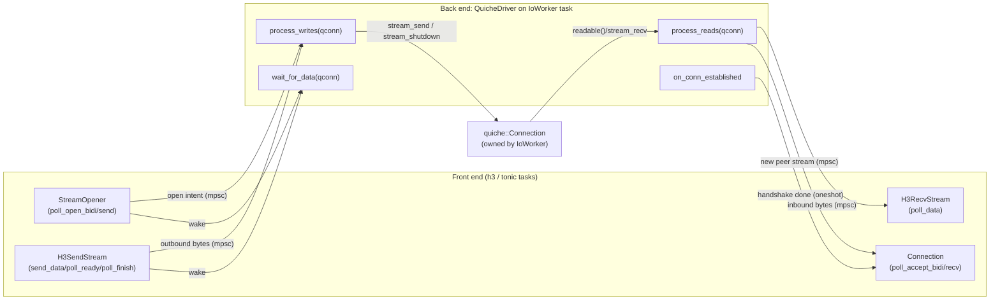

# Design: `quiche-h3` — an `h3::quic` bridge over `tokio-quiche`

Status: draft / proposal — **pre-implementation spike gates RESOLVED** (pinned
`tokio-quiche 0.19.1` / `quiche 0.29.3`, recorded 2026-07-17; loopback spikes in
`quiche-h3/tests/spike_harness.rs`, full outcomes in
`quiche-h3/tests/SPIKE_OUTCOMES.md`). The design was previously **BLOCKED** behind
a set of pre-implementation verifications that are *correctness gates*, not
follow-ups; their outcomes are now recorded in this document (§5.5, §14). The
original gate list:

1. the **zero-send-capacity writable-only peer bidi discovery** blocker (§5.5
   BLOCKER) — closed by spike outcome 1 or 2, or the correctness claim explicitly
   narrowed per outcome 3;
2. **committed contract A**'s premise — that a fully-terminal id can never reappear
   in `readable()`/`writable()` discovery (§5.5 admission-tombstone spike);
3. the pinned-crate API/behavior spikes recorded in **§14** (the tokio-quiche
   worker-loop invocation and normal close-flush contracts, connection-handle drop
   semantics, the `QuicConnectionStream` item-error taxonomy (§14 T4), the
   load-bearing quiche stream calls, send-shutdown and FIN behavior under
   zero flow-control capacity (§14 Q3/Q5), registered-stream STOP_SENDING
   visibility, `Connection::close` result semantics, and the h3 0.0.8 error
   surface).

**Resolution (recorded 2026-07-17; pinned `tokio-quiche 0.19.1` / `quiche 0.29.3`;
loopback spikes in `quiche-h3/tests/spike_harness.rs`, outcomes in
`quiche-h3/tests/SPIKE_OUTCOMES.md`):** all gates are resolved and implementation
may proceed per `docs/design/quiche-h3-implementation-plan.md`.

- **Item 1 (zero-send-capacity writable-only discovery blocker) — CONFIRMED as a
  real gap → design adopts §5.5 outcome 3.** `stream_writable_next()` and
  `writable()` return nothing when connection `tx_cap == 0` (the guard runs
  *before* the STOP_SENDING-stopped branch, so even a stopped stream is not
  surfaced). No public quiche 0.29 API enumerates the unknown id at zero capacity.
  The drop-in correctness claim is therefore **explicitly narrowed** for the
  pathological case where a peer opens a bidi stream while our connection-level
  send capacity is exhausted (see §5.5).
- **Item 2 (admission-tombstone premise, committed contract A) — CONFIRMED** for
  the normal full-completion path: a fully-terminal id does not reappear in
  `readable()`/`writable()`/`stream_*_next()` discovery. Contract A ships as-is;
  the upstream `stream_collected(id)` fallback is reserved only if the adversarial
  late-`STOP_SENDING` path is later shown to resurrect an id (see §5.5).
- **Item 3 (§14 API/behavior checks) — all CONFIRMED** on the pinned build, with
  two recorded nuances: T2a's client cert-rejection surfaces as an `io::TimedOut`
  (not a TLS-typed error), and T4's malformed datagrams are silently dropped below
  the accept stream rather than surfaced as per-item errors. Verified surfaces
  retain CI compatibility tests (§10).

This document incorporates seventeen rounds of design review. A subsequent
external code-review round then made queued bytes and accepted streams win over
terminals through an explicit **sealing edge plus one-shot consumer recheck**
(§5.1/§6), gave `on_conn_close` a **finite close-admission cut** so submissions
racing the close resolve with the classified connection terminal instead of a bare
cancel (§5.2), classified `QuicConnectionStream` item errors as **recoverable
per-attempt failures** rather than acceptor-wide fatals (§7.1/§14 T4), specified the
**named public connector/acceptor construction contract** and one-acceptor-per-socket
mapping (§7), corrected the pinned `h3` send-sequence and dropped the nonexistent
`Is0rtt` claim (§2.1/§8.4), **qualified the unbounded command channel** as a
caller/configuration-controlled bound rather than absolutely blow-up-proof (§5.2),
and recorded the **zero-capacity FIN** and **no-runtime-drop** verification cases
(§11/§14 Q5). The latest internal round
orders reset shutdown ahead of terminal-id eviction, makes parked-terminal
promotion initialize both worker and front-end lifecycle state, and makes
writable discovery of `STOP_SENDING` complete queued send operations before
runnable cleanup. The preceding round made local reset preempt every
not-yet-accepted write/FIN remainder, made parked peer streams retain a later
`STOP_SENDING`, and made round-robin runnable-stream write scheduling part of the
initial design. The earlier round made the shared
receive pump run exactly once per acting iteration (so every receive-stage quota,
not only its chunk budget, is per-iteration) and added an explicit-close barrier
that applies a staged close before last-handle teardown regardless of a saturated
stream-write batch. The earlier round corrected the
pinned worker contract (packet-driven `process_reads`, every-acting-iteration
`process_writes`), made pre-handshake failure reporting independent of
`on_conn_close`, made channel EOF a one-shot wake, preserved explicit local-close
precedence, completed the send/finish front-end state machines, and bounded
accept-side handshakes. The earlier round specified the **send-side state
machine**: each `StreamSendState` holds an ordered `Write`/`Finish` queue, with
each completion oneshot fired exactly once at the transport-acceptance boundary
(`Ok` on accept, `Err(SendEnd::Stopped)` on `STOP_SENDING`,
`Err(SendEnd::Conn)` on close), and `on_conn_close` drains registry-held
completions too (§5.3a); the latest round adds reset's explicit preemption
exception. That earlier round also narrowed the ordering claim to Tokio's actual
per-sender guarantee and fixed the **`ReadBudget`** to **one per worker iteration** across a
`process_reads`+`process_writes` pair. Earlier rounds resolved: committed contract
A (removed reclaim subsystem), close replies to `Send`/`Finish`, shared
`ReadBudget`, atomic admission transfer, shared read-pump helper, `pending_admit`
owning `PeerStream`, chunk-budgeted reads, destructive readable intake,
membership-guarded cursors, one terminal transition, `Connection::drop` parked
cleanup, pessimistic writable continuation, removed unsafe watermark, receive/write
budgets, `needs_iteration` recomputation, atomic resume ordering, pending-work
fast path, producer-coalesced resume, per-class accept parking, retained parked
terminal state, per-direction accept-terminal cells, writable-path peer bidi
admission, direction-aware cleanup, owned connector config, distinct open-request
types, per-direction cleanup idempotence, race-free `TerminalCell` polling, weak
worker command sender, reserve-before-`stream_recv`, materialized-stream cleanup,
graceful `H3_NO_ERROR` teardown, unbounded control channel with bounded
data/accept queues, `stream_priority` materialization, two-phase reads, typed
out-of-band terminals, idle `STOP_SENDING`, low-water write re-arm, local-vs-peer
close, and the `tokio-quiche` wiring.
Scope: a new bridge crate that lets the hyperium [`h3`](https://docs.rs/h3)
stack (and therefore `tonic-h3` / `h3-util`) run HTTP/3 on top of Cloudflare's
[`quiche`](https://docs.rs/quiche) transport, driven asynchronously by
[`tokio-quiche`](https://docs.rs/tokio-quiche).

## 1. Goal

Provide a `quiche` backend for `h3-util` that is API-compatible with the
existing `quinn`, `s2n-quic`, and `msquic` backends, so that `tonic-h3` gRPC
clients and servers can use `quiche` as their QUIC transport with no changes
above the transport layer.

Concretely we deliver:

- A standalone `quiche-h3` crate (this repo) that implements the raw
  `h3::quic` stream traits over a `quiche::Connection` driven by `tokio-quiche`.
  This is the analogue of the `msquic-h3` crate.
- Wrapper types `H3QuicheConnector` (client) and `H3QuicheAcceptor` (server) in
  `h3-util`'s existing `quiche_h3` module, implementing `H3Connector` and
  `H3Acceptor`.

Non-goals (for the first cut): HTTP/3 datagrams, WebTransport, 0-RTT, connection
migration, `qlog` plumbing, and zero-copy buffer reuse. These are called out as
follow-ups in §12.

## 2. Background

### 2.1 Two different HTTP/3 stacks

There are **two independent HTTP/3 implementations** in play, and the whole
design hinges on not confusing them:

- **hyperium `h3`** — a pure-Rust HTTP/3 implementation that is *transport
  agnostic*. It performs its own HTTP/3 framing, QPACK, control/encoder/decoder
  streams, SETTINGS and GREASE. It sits on top of any QUIC transport that
  implements the poll-based traits in `h3::quic`:
  `Connection`, `OpenStreams`, `SendStream`, `RecvStream`, `BidiStream`.
  `tonic-h3` and `h3-util` are built on this crate.

- **`quiche::h3`** — quiche's *own* HTTP/3 layer, and the ready-made
  `H3Driver` / `ServerH3Driver` / `ClientH3Driver` that `tokio-quiche`
  re-exports. It exposes an *event* model (`H3Event`, `H3Controller`,
  `IncomingH3Headers`, `OutboundFrame`), not raw QUIC streams.

These stacks are mutually exclusive: if we use `quiche::h3` we cannot present
`h3::quic` streams to `tonic-h3`, and if we present `h3::quic` streams we must
*not* use `quiche::h3`.

#### Reference backends reviewed

- **`h3-quinn`** (`hyperium/h3`) — the canonical `h3::quic` adapter. It is
  *trivial* (no channels, no worker task) because `quinn` is natively async and
  already exposes real per-stream objects (`quinn::SendStream`/`RecvStream`,
  `open_bi().await`, `accept_bi().await`) that map ~1:1 onto the `h3::quic`
  traits. It also implements the optional `SendStreamUnframed` (`poll_send`)
  trait. (There is **no** `Is0rtt` trait in the pinned `h3 0.0.8` /
  `h3-quinn 0.0.10` surface — §14 H1 — so no such trait is claimed here.)
  `quiche-h3` **cannot** copy this shape: quiche exposes no
  async stream objects, only a single `&mut Connection` reachable from one task.
- **`msquic-h3`** — the applicable model: msquic, like quiche, is a low-level
  QUIC library with no async stream objects, so it bridges the `h3::quic` poll
  traits to the transport via `mpsc`/`oneshot` channels. `quiche-h3` follows this
  shape (§3).

One contract detail both references make explicit and that shapes §6: the `h3`
crate's **send path is a single-slot stash, not a queue**. `SendStream::send_data`
only *stores* one `WriteBuf` (calling it again while one is pending is a misuse /
bug); `SendStream::poll_ready` flushes a stashed buffer to the transport. The
pinned `h3 0.0.8` write helper calls **`send_data` first and then awaits
`poll_ready`** until that stashed operation completes — it does **not** use
`poll_ready` as a preflight before the first/next `send_data` (verified against the
pinned source; §14 H1). Independently, `poll_ready` is also a readiness probe that
may run with **no** buffer stashed (idle, or between operations). In that no-buffer
state it must return `Ready(Ok(()))` immediately after checking the sticky send
terminal; it must not wait for a completion that can only be created by enqueueing
a buffer. This idle immediate-readiness is deliberate, reference-backend-compatible
behavior (`h3-quinn` uses this `writing == None` fast path; `msquic-h3` notes
"poll_ready is called after send_data … to ensure data is sent."), not an inference
that `h3` preflights `poll_ready` ahead of `send_data`.

> **Key decision.** `quiche-h3` deliberately **does not** use `tokio-quiche`'s
> `H3Driver`. It uses only `tokio-quiche`'s *QUIC transport* layer (the
> `ApplicationOverQuic` worker, socket ownership, packet routing, handshake,
> pacing/congestion, timers) and surfaces the **raw `quiche` streams** to the
> hyperium `h3` crate, which does the HTTP/3 work.

### 2.2 The `h3-util` abstraction

Backends plug into `h3-util` by implementing two traits
(`h3-util/src/client.rs`, `h3-util/src/server.rs`):

```rust
pub trait H3Connector: Send + 'static + Clone {
    type CONN: h3::quic::Connection<Bytes, OpenStreams = Self::OS, SendStream = Self::SS,
                                    RecvStream = Self::RS> + Send;
    type OS: h3::quic::OpenStreams<Bytes, BidiStream = Self::BS> + Clone + Send;
    type SS: h3::quic::SendStream<Bytes> + Send;
    type RS: h3::quic::RecvStream + Send;
    type BS: h3::quic::BidiStream<Bytes, RecvStream = Self::RS, SendStream = Self::SS> + Send;
    fn connect(&self) -> impl Future<Output = Result<Self::CONN, Error>> + Send;
}

pub trait H3Acceptor {
    type CONN: h3::quic::Connection<Bytes, /* ... same assoc types ... */> + Send + 'static;
    /* OS / SS / RS / BS ... */
    fn accept(&mut self) -> impl Future<Output = Result<Option<Self::CONN>, Error>> + Send;
}
```

So the entire job of a backend is to provide types that implement the five
`h3::quic` traits, plus a connector/acceptor to mint connections. `msquic-h3` is
the closest existing model because msquic, like quiche, is a low-level QUIC
library with no built-in async and no hyperium-shaped stream objects.

### 2.3 `tokio-quiche` transport model

`tokio-quiche` runs **one `IoWorker` task per connection**. The worker owns the
socket send half (the recv half is owned by a shared `InboundPacketRouter` that
demuxes by DCID), and it drives an `ApplicationOverQuic`:

```rust
pub trait ApplicationOverQuic: Send + 'static {
    fn on_conn_established(&mut self, qconn: &mut QuicheConnection,
                           hs: &HandshakeInfo) -> QuicResult<()>;
    fn should_act(&self) -> bool;
    fn buffer(&mut self) -> &mut [u8];
    fn wait_for_data(&mut self, qconn: &mut QuicheConnection)
        -> impl Future<Output = QuicResult<()>> + Send;   // MUST be cancel-safe
    fn process_reads(&mut self, qconn: &mut QuicheConnection) -> QuicResult<()>;
    fn process_writes(&mut self, qconn: &mut QuicheConnection) -> QuicResult<()>;
    fn on_conn_close<M: Metrics>(&mut self, ...);          // provided
}
```

The worker loop is: feed any inbound packets into the `quiche::Connection` → if
`should_act()`, call `process_reads` **only when packets were received**, then
call `process_writes` on every acting iteration → flush outbound packets → yield
until a packet arrives, a timer fires, or `wait_for_data` resolves.

> **Pinned invocation contract (verified against the published tokio-quiche
> 0.19.1 trait docs and source; see §14 spike T1).** The trait-level summary is
> abbreviated; the method docs and `RunningApplication::on_read` provide the
> operative distinction. If `should_act()` is true, `process_reads` is called
> only when `received_packets` is true, while `process_writes` is called on every
> acting iteration (after `process_reads` when reads ran). `should_act()` is
> checked in each iteration (only `on_conn_established`/`buffer` bypass it).
> Consequences the whole of §5 depends on:
>
> 1. A **packet-driven acting iteration** runs reads then writes. A **no-packet
>    acting iteration** (timer or application wake) skips `process_reads` and runs
>    only `process_writes`. The shared read-pump helper is therefore reachable from
>    both callbacks: `process_reads` handles the packet path, and
>    `process_writes` continues bridge-owned readable/admission work on the
>    no-packet path. `reads_ran_this_iter` selects exactly one **pump invocation**:
>    packet-path `process_reads` resets `ReadBudget`, sets the flag, and runs the
>    helper; the following `process_writes` skips its helper call. On the no-packet
>    path, `process_writes` sees a false flag, resets `ReadBudget`, and runs the
>    helper. The writes tail clears the flag at the common iteration boundary.
>    Thus `DISCOVERY_BUDGET`, `RECV_RESUME_BUDGET`, `READABLE_BUDGET`,
>    `ADMIT_BUDGET`, `PROMOTE_BUDGET`, per-id `CHUNK_BUDGET`, and the shared chunk
>    `ReadBudget` are each consumable at most once per acting iteration.
> 2. **The worker does not self-reschedule between network events.** A new
>    iteration only begins on a packet, a timer, or `wait_for_data` resolving; the
>    docs explicitly say *"after `wait_for_data` resolves, `process_writes` should
>    be used to pull all available data out of the event source."* This is why the
>    design still needs `needs_iteration` plus the `wait_for_data` pending-work
>    fast path (§5): work deferred under a per-iteration budget with **no** network
>    activity would otherwise sleep until the idle timeout. On such a no-packet
>    wake, the read-pump call from `process_writes` is the only application read
>    callback path, and it drains the bridge-owned cursors left by earlier packet
>    work.

The crucial property: **`&mut quiche::Connection` is only available inside these
callbacks, on the worker task.** Every stream operation (`stream_recv`,
`stream_send`, `stream_finished`, `stream_shutdown`, `readable()`, `writable()`)
must run on that task. Entrypoints: `listen()` → `QuicConnectionStream` of
`InitialQuicConnection`; `IQC::start(app)` spawns the worker with our app.
Clients use `quic::connect_with_config(socket, host, &params, app)` (§7.2).

> **Worker-lifetime ownership (verified against tokio-quiche 0.19 docs; see §14
> spike T2).** `InitialQuicConnection::start(app)` *"drives a QUIC connection from
> handshake to close in separate tokio tasks"* and returns a `QuicConnection` that
> is only *"metadata about an established QUIC connection … it notably does not
> represent the `quiche::Connection` itself,"* which lives entirely in the spawned
> worker task. **Worker lifetime is owned by that spawned task, not by the returned
> `QuicConnection` handle.** The worker runs until the connection closes, the last
> front-end `cmd_tx` handle drops (last-handle teardown, §5.2), or the app returns
> an error — *not* when the `QuicConnection` metadata handle is dropped. Therefore
> the `let _qconn = …` binding in §7.1/§7.2 may be dropped safely without tearing
> down the accepted/connected session. §14 spike T2 re-confirms this drop
> behavior against the pinned build before implementation.

## 3. Central problem and the bridging pattern

The hyperium `h3` crate calls poll-based methods (`poll_open_bidi`,
`poll_data`, `poll_ready`, `send_data`, …) from *arbitrary* async tasks (the
connection driver task, request tasks). But quiche can only be touched from the
`IoWorker`. So `quiche-h3`, like `msquic-h3`, splits into a **front end** and a
**back end** joined by channels:

- **Back end** — our `ApplicationOverQuic` impl (call it `QuicheDriver`). Lives
  on the `IoWorker` task, holds the bridging state, and is the *only* code that
  touches `&mut quiche::Connection`. It moves bytes between quiche streams and
  per-stream channels inside `process_reads` / `process_writes`.

- **Front end** — the `h3::quic` objects (`Connection`, `StreamOpener`,
  `H3SendStream`, `H3RecvStream`, `H3Stream`) that `h3-util`/`tonic` hold. They
  never call quiche; they only push/pull on channels and arm a waker.

The difference from `msquic-h3` is the direction of control:

| | `msquic-h3` | `quiche-h3` |
|---|---|---|
| Transport drive model | msquic C threads invoke per-stream/-conn **callbacks** (push) | single `IoWorker` **polls** `process_reads`/`process_writes` (pull) |
| Who owns transport state | msquic internally | our `QuicheDriver` on the worker task |
| Front↔back link | callback → `mpsc`/`oneshot` → front end | front end → `DriverCommand` mpsc → worker loop; worker → out-of-band `TerminalCell`s → front end |
| Wakeup of transport | implicit (callbacks fire) | explicit: front end must wake the worker via `wait_for_data` |

That last row is the main new mechanism: when the front end wants the worker to
do something (send bytes, open a stream, finish, reset), it must both enqueue
the intent on a channel **and** wake the worker's `wait_for_data` future.

### 3.1 Data-flow diagram



## 4. Trait mapping

### 4.1 `h3::quic` → quiche transport operations

| `h3::quic` method | quiche transport realization (on worker) |
|---|---|
| `Connection::poll_accept_bidi` | worker admits a new peer-initiated **bidi** stream discovered on **either** the readable path (`qconn.readable()`) **or** the writable path (`stream_writable_next()`, e.g. a stream created by a first `STOP_SENDING`/`MAX_STREAM_DATA`; §5, finding 1); forwards `H3Stream` over the bidi accept channel |
| `Connection::poll_accept_recv` | same for peer-initiated **uni** streams (readable path); forwards the recv half |
| `Connection::opener` | clone a `StreamOpener` (shares conn state + waker) |
| `OpenStreams::poll_open_bidi` | allocate next client/server bidi stream id under peer flow-control limit; register buffers; wake worker |
| `OpenStreams::poll_open_send` | allocate next uni stream id; register; wake worker |
| `OpenStreams::close` | request `qconn.close(app=true, code, reason)` on the worker |
| `SendStream::send_data` | **stash** one `WriteBuf<Bytes>` in the stream's single send slot (error if one is already pending); does **not** transmit |
| `SendStream::poll_ready` | if a send completion is in flight, poll and report that recorded result exactly once **before** consulting sticky `status`; otherwise sticky `Stopped`/local-`Reset`/`Conn` rejects idle/new work, no stashed buffer returns `Ready(Ok(()))`, and a stashed buffer is sent to the worker and completed when quiche accepts it |
| `SendStream::poll_finish` | use a stored finish-completion receiver/state; enqueue one FIN exactly once, worker calls `stream_send(.., fin=true)`, and repeated polls reuse the recorded completion |
| `SendStream::reset` | enqueue reset(code); worker preempts any not-yet-accepted `Write`/`Finish` remainder, completes it once with the local-reset terminal, and calls `stream_shutdown(id, Shutdown::Write, code)` without waiting for send capacity |
| `SendStream::send_id` | stream id assigned at open time (known to front end) |
| `RecvStream::poll_data` | pull next `Bytes` chunk from the stream's inbound channel; `None` on FIN |
| `RecvStream::stop_sending` | enqueue stop; worker calls `stream_shutdown(id, Shutdown::Read, code)` |
| `RecvStream::recv_id` | stream id known to front end |
| `BidiStream::split` | return the pre-split `H3SendStream` + `H3RecvStream` halves |

### 4.2 Types (mirroring `msquic-h3`)

```
quiche-h3/src/lib.rs
    Connection        // impl h3::quic::Connection<B> + OpenStreams<B> (bypass)
    StreamOpener      // impl h3::quic::OpenStreams<B>, Clone
    H3Stream          // impl h3::quic::BidiStream<B> = { send, recv }
    H3SendStream      // impl h3::quic::SendStream<B>
    H3RecvStream      // impl h3::quic::RecvStream
    QuicheDriver      // impl tokio_quiche::ApplicationOverQuic  (back end)
quiche-h3/src/listener.rs
    Listener          // wraps tokio_quiche::listen() QuicConnectionStream; accept()
quiche-h3/src/connector.rs (or in lib)
    connect(...)      // client: quic::connect_with_config + QuicheDriver
```

## 5. Back end: `QuicheDriver`

`QuicheDriver` holds all cross-task state and is the sole toucher of quiche.

State (sketch):

```rust
struct QuicheDriver<B: Buf = Bytes> {
    // Cross-task shared state; holds the connection-level `conn_terminal` cell the
    // close-admission gate publishes and every submitter reads (§5.2, M3).
    shared: Arc<ConnShared>,
    // UNBOUNDED control ingress (§5.2): lifecycle/control commands must be
    // reliable and infallible from synchronous, `()`-returning trait methods
    // (`reset`, `stop_sending`) and must never drop the `RecvResume`/accept-resume
    // correctness signals. Per-stream send backpressure comes from the h3
    // single-slot contract; aggregate channel residency is caller/configuration-
    // controlled, NOT an absolute bound (§5.2, S3). Mirrors tokio-quiche's own H3
    // driver (unbounded commands, bounded data). Closed by the worker at the
    // connection-terminal edge to make the `on_conn_close` drain finite (M3).
    cmd_rx: mpsc::UnboundedReceiver<DriverCommand<B>>,
    // WEAK sender the worker upgrades to build handles for accepted peer streams
    // (finding 2). A weak sender does NOT keep the channel open, so it preserves
    // the last-handle teardown signal; `upgrade()` returning `None` == teardown
    // in progress (stop admitting).
    cmd_tx_weak: mpsc::WeakUnboundedSender<DriverCommand<B>>,
    inbox: VecDeque<DriverCommand<B>>,   // commands pulled off cmd_rx, applied in process_writes
    // per-stream registries (worker-owned; the front end never touches quiche).
    send: HashMap<u64, StreamSendState>, // single-slot WriteBuf + finish/reset + status cell
    recv: HashMap<u64, StreamRecvState>, // BOUNDED byte Sender + out-of-band terminal cell + `blocked`
    // pending OpenStreams requests, drained only under stream credit (§6.1). The
    // two queues hold DIFFERENT request types (finding 5): a bidi open returns
    // both halves, a uni open returns only a send half.
    open_bidi: VecDeque<OpenBidiRequest>,
    open_uni:  VecDeque<OpenUniRequest>,
    // BOUNDED accept side of `Connection` (finding 3): the worker sends with
    // `try_reserve`/`try_send` (no `await` in `process_reads`); the connection
    // terminal is delivered out of band so a full queue can never hide shutdown.
    accept_bidi: mpsc::Sender<H3Stream>,
    accept_uni:  mpsc::Sender<H3RecvStream>,
    // Separate accept-terminal cells per direction (finding 5): the `h3::quic`
    // trait does not guarantee `poll_accept_bidi` and `poll_accept_recv` are
    // polled by the same task, so one `AtomicWaker` cannot serve both.
    accept_terminal_bidi: TerminalCell<Arc<ConnTerminal>>,
    accept_terminal_uni:  TerminalCell<Arc<ConnTerminal>>,
    // Admission bookkeeping: `admit` holds **only** ids we have actually observed,
    // no high-watermark (iter8 finding 2). Per-direction completion is tracked so a
    // stream is reclaimed on **any** clean or abrupt end, not only a peer reset
    // (iter9 finding 3):
    //   enum AdmitState {
    //       Parked(PeerStream), // owns terminals observed before promotion
    //       Registered { send_done: bool, recv_done: bool },
    //   }
    // **Contract A (committed, iter11 finding 2/3):** a peer UNI stream is terminal
    // when its recv direction ends and a peer BIDI when BOTH local directions end;
    // on that edge the entry is dropped from `admit` **immediately**. This is
    // correct iff a fully-terminal id can never reappear in `readable()`/`writable()`
    // discovery \u2014 the property the \u00a75.5 spike must confirm. There is deliberately
    // **no** reclaim subsystem here: `admit` only prevents re-admission, and quiche's
    // own credit accounting is independent. `stream_closed(id)` is **never** used
    // (it signals FIN, not collection or credit, iter10 finding 4). If the spike
    // disproves the property, the fix is an upstream `stream_collected(id)` API
    // (\u00a75.5), not a speculative in-crate tombstone sweep. Parking is INDEPENDENT
    // per class.
    // Parked PeerStream values live in `admit`, keyed for O(1) terminal merging;
    // these class queues contain only ids and define bounded promotion order.
    parked_bidi: VecDeque<u64>,
    parked_uni:  VecDeque<u64>,
    admit: HashMap<u64, AdmitState>,
    // Bridge-owned receive cursors with membership sets for EXACT-ONCE queueing
    // (iter9 finding 2). Ids come **destructively** from `stream_readable_next()`
    // (dearmed in quiche on return), so the full `readable()` snapshot is never
    // materialized. Intake + admission run from a shared helper callable from
    // BOTH `process_reads` and `process_writes` (iter10 finding 2). A single
    // `ReadBudget` (iter11 finding 5) is threaded through registered-drain,
    // admission-drain, and promotion-drain so all receive chunk work in one
    // callback shares ONE decrementing counter.
    pending_readable: VecDeque<u64>, readable_set: HashSet<u64>, // registered ids to drain
    // New peer ids awaiting admission, **owning** their captured `PeerStream`
    // (incl. any writable-path `pending_send_terminal` grabbed before admission),
    // so a deferred admission never loses the `STOP_SENDING` code (iter10 finding 3).
    // The map key is the membership set; a readable + a writable discovery of the
    // same id MERGE into one entry. Every admission exit path (register / park /
    // cleanup) pops the id from `pending_admit_order` AND removes it from
    // `pending_admit` atomically (iter11 finding 6), so an empty order queue is an
    // exact runnable-work predicate.
    pending_admit_order: VecDeque<u64>,
    pending_admit: HashMap<u64, PeerStream>,
    pending_resume:   VecDeque<u64>, resume_set:   HashSet<u64>, // resumed (bit-transitioned) ids
    // The sole stage-(e) selection source. Membership gives exact-once queueing;
    // ids are appended at the tail and receive one bounded transport-call turn
    // before any still-runnable id is appended again.
    runnable_send: VecDeque<u64>,
    runnable_send_set: HashSet<u64>,
    // Producer-coalesced resume (finding 3): each recv half and each accept
    // direction shares an `Arc<AtomicBool>` with the worker. A producer sends a
    // RecvResume/Accept*Resume command ONLY on a false->true transition, so
    // duplicates never reach the channel or the command budget. `needs_iteration`
    // (finding 5) makes `wait_for_data` reschedule when a stage deferred runnable
    // work under its per-iteration quota.
    accept_bidi_resume: Arc<AtomicBool>,
    accept_uni_resume:  Arc<AtomicBool>,
    needs_iteration: bool,
    // Set when cmd_rx is disconnected (the last strong front-end sender dropped).
    // `wait_for_data` turns channel EOF into exactly one normal worker iteration;
    // process_writes handles qconn.close, then graceful_close_issued makes future
    // application waits pending while packet/timer events drive closing.
    last_handle_teardown: bool,
    graceful_close_issued: bool,
    // Stage (a) never leaves an accepted explicit Close only in transient command
    // state: the first one is moved here until the post-write close barrier applies
    // it. Later Close commands are idempotent no-ops once one is pending/attempted.
    pending_close: Option<PendingExplicitClose>,
    explicit_close_attempted: bool,
    // First successfully-applied local application close. An explicit Close is
    // retained (including reason); explicit_close_attempted also prevents a `Done`
    // result from being followed by synthetic H3_NO_ERROR (§5.2, §8.3).
    local_close: Option<RecordedLocalClose>,
    // ONE shared-read-pump invocation per acting worker iteration. On a packet
    // iteration process_reads resets ReadBudget, sets the flag, and runs the pump;
    // process_writes sees the flag and SKIPS its pump. On a no-packet iteration
    // process_reads is skipped, so process_writes sees false, resets ReadBudget, and
    // runs the pump. Its tail clears the flag at the common iteration boundary.
    // Thus all receive quotas, including ReadBudget, are consumable only once.
    read_budget: usize, reads_ran_this_iter: bool,
    // TWO distinct buffers with DIFFERENT roles and sizes (finding: buffer/scratch
    // must not be conflated):
    //  * `pkt_buf` backs `ApplicationOverQuic::buffer()`, the worker's OUTBOUND
    //    packet buffer (tokio-quiche docs: "a borrowed buffer for the worker to
    //    write outbound packets into … can be used to artificially restrict the
    //    size of outbound network packets"). It is sized for a full GSO send batch
    //    (`PKT_BUF_LEN`, e.g. 64 KiB — at least `max_send_udp_payload_size`, larger
    //    to amortize batched sends), NOT capped at MAX_CHUNK, so packet throughput
    //    is not throttled to the stream chunk size.
    //  * `recv_buf` is the `stream_recv` target. It is a lazily-allocated,
    //    *reused* `BytesMut` arena (SF-5: nothing is allocated until the first
    //    readable byte; SF-1: reused across chunks). Each read grows a MAX_CHUNK
    //    window (§5.1) and carves the filled prefix out with `split_to(len)
    //    .freeze()` — an O(1) refcounted slice sharing the arena's backing, so
    //    h3 gets an owned `Bytes` with no per-chunk copy. A fresh RECV_ARENA
    //    block (a small multiple of MAX_CHUNK) is reserved only when the arena is
    //    exhausted or still shared by a live frozen chunk, amortizing allocation.
    pkt_buf: Vec<u8>,                    // buffer(): outbound packet buffer, len PKT_BUF_LEN
    recv_buf: Option<BytesMut>,          // reused stream_recv arena, lazily allocated (SF-1/SF-5)
    // Handshake-completion signal. on_conn_close is gated by should_act(), which is
    // false before establishment, so it CANNOT classify handshake failures. On
    // success on_conn_established sends Ok. If the app is dropped first, Drop sends
    // Err(SetupFailure::PreHandshakeWorkerExit), independently of on_conn_close.
    // Client connect additionally has tokio-quiche's raw handshake Err (§7.2).
    established: Option<oneshot::Sender<Result<HandshakeInfo, SetupFailure>>>,
}

struct RecordedLocalClose { error_code: u64, reason: Bytes, explicit: bool }
struct PendingExplicitClose { error_code: u64, reason: Bytes }
enum SetupFailure { PreHandshakeWorkerExit }

// Cross-task shared state every front-end handle can read without touching quiche.
// `conn_terminal` is the connection-level sealing/close-admission cell (M3): the
// worker publishes the classified `Arc<ConnTerminal>` here (in `on_conn_close`, or
// at last-handle teardown) at the SAME edge it calls `cmd_rx.close()`, so any
// front-end submission that races the close reads a populated terminal and resolves
// its caller with it instead of a bare `oneshot` cancel (§5.2). It is set
// first-writer-wins, like the per-half cells.
struct ConnShared {
    conn_terminal: TerminalCell<Arc<ConnTerminal>>, // published once at the close edge
    // peer transport params (stream limits) stashed by on_conn_established, etc.
}

// A `TerminalCell<T: Clone>` is a sticky, out-of-band, *pollable* one-shot —
// conceptually `Arc<(Mutex<Option<T>>, AtomicWaker)>`, **first-writer-wins**. The
// worker `set`s the value once, then `wake()`s. Front-end poll methods MUST use
// the race-free order (finding 1), so a value set between the check and the waker
// registration is never missed:
//   1. (optional) fast-path: read the value; if present, return it.
//   2. `waker.register(cx.waker())`.
//   3. re-read the value.
//   4. return `Pending` only if step 3 is still empty.
// The sticky value is *cloned out* on each poll, so repeated polls stay
// consistent. An `AtomicWaker` holds ONE waker, so each cell has exactly one
// logical poller: a stream half's cell is polled only by that half; the
// **per-direction** accept cells (`accept_terminal_bidi`/`accept_terminal_uni`)
// are each polled only by their own accept method, so even if `poll_accept_bidi`
// and `poll_accept_recv` run on *different* tasks each has its own `AtomicWaker`
// (finding 5). We use this rather than `tokio::sync::watch` because
// `watch::Receiver::changed()` is an async future while the `h3::quic` methods
// are synchronous `poll_*(cx)` fns.
struct StreamRecvState {
    bytes: mpsc::Sender<Bytes>,        // BOUNDED (depth configurable, default BYTE_CHANNEL_DEPTH); worker reserves a permit before stream_recv
    terminal: TerminalCell<RecvEnd>,   // out-of-band sticky end reason
    resume: Arc<AtomicBool>,           // shared pending-resume bit; producer sets on false->true (finding 3)
    // SF-2: shared park flag, published Release by the worker before its capacity
    // re-check and swapped AcqRel-clear by the consumer, so a `RecvResume` is sent
    // only when the reader had actually parked (no resume on every consumed chunk)
    // while never dropping a genuine resume.
    blocked: Arc<AtomicBool>,
}
struct StreamSendState {
    // Ordered per-stream Write/Finish queue (iter12 findings 3 & 4). A Reset is
    // deliberately not queued behind it: stage (a) moves reset intent into
    // `pending_reset`, drains every not-yet-accepted Write/Finish exactly once with
    // the local-reset terminal, and makes the id runnable. Each accepted op has
    // already been removed and completed Ok, so reset cannot rewrite that result.
    // `on_conn_close` drains any surviving completion with `SendEnd::Conn`.
    //   enum SendOp {
    //     // SF-3: completion rides a reusable per-stream `WriteCompleter` stamped
    //     // with a generation instead of a freshly-allocated oneshot per chunk.
    //     // SF-6: the RAII `SendBytesPermit` reserves the write's wire bytes
    //     // against the aggregate send-byte cap and releases them on the op's
    //     // exactly-once completion/drain (or drop).
    //     Write  { buf: WriteBuf<B>, done: WriteCompleter<SendEnd>, permit: Option<SendBytesPermit> },
    //     Finish { done: oneshot::Sender<Result<(), SendEnd>> },
    //   }
    send_ops: VecDeque<SendOp>,
    pending_reset: Option<u64>,        // first local reset; not flow-control blocked
    terminal: Option<SendEnd>,         // sticky send terminal (Stopped / local reset / Conn)
    status: TerminalCell<SendEnd>,     // out-of-band sticky end reason (mirrors `terminal`)
}
struct OpenBidiRequest { reply: oneshot::Sender<Result<StreamHalves,  Arc<ConnTerminal>>> }
struct OpenUniRequest  { reply: oneshot::Sender<Result<H3SendStream,  Arc<ConnTerminal>>> }

// A parked peer stream retains any terminal observed BEFORE accept capacity
// existed (finding 4) — e.g. a `SendEnd::Stopped { code }` seen on the writable
// path. Admission/promotion consumes these values with one atomic registration
// helper that initializes the worker's terminal/done state as well as the new
// half's TerminalCell before handing the stream over; quiche is not guaranteed
// to re-surface the event.
struct PeerStream {
    id: u64,
    pending_send_terminal: Option<SendEnd>,
    pending_recv_terminal: Option<RecvEnd>,
}
```

- **`on_conn_established`** — signal the front end that the handshake is complete
  so `connect()`/`accept()` can return a usable `Connection`: send
  `Ok(HandshakeInfo)` through the `established` oneshot (taking the `Some` sender);
  stash peer transport params (stream limits) into `shared`. If the connection
  fails *before* this callback, `should_act()` is still false and tokio-quiche
  does **not** invoke `on_conn_close`; `QuicheDriver::drop` instead consumes the
  sender with `Err(SetupFailure::PreHandshakeWorkerExit)` (§7.1, §8.4). That
  signal intentionally carries no fabricated transport code.
- **`should_act`** — `true` once established (we always have potential work), so
  per the §2.3 contract `process_writes` runs on every post-handshake iteration
  and `process_reads` runs on those iterations that received packets. It must
  remain false during handshake so tokio-quiche drives its handshake callbacks.
- **`buffer`** — return `&mut self.pkt_buf`, the **outbound packet buffer**
  (`PKT_BUF_LEN`, e.g. 64 KiB), **not** the `MAX_CHUNK`-capped `stream_recv`
  scratch. `buffer()` is where tokio-quiche writes outbound packets and doubles as
  the send-batch size bound; sizing it to a full GSO batch keeps UDP throughput
  independent of the per-stream read chunk size (finding: buffer/scratch
  separation).
- **`wait_for_data`** — first takes a **pending-work fast path** (finding 2), then
  awaits the command channel:
  ```rust
  if self.graceful_close_issued {
      // EOF/close is already consumed. Do not poll the disconnected receiver:
      // recv() would return None immediately forever. Packet/timer branches of
      // the worker's select continue driving closing/draining.
      return std::future::pending::<QuicResult<()>>().await;
  }
  if !self.inbox.is_empty() || self.needs_iteration {
      tokio::task::yield_now().await;   // fairness; the worker's biased select keeps timer priority
      return Ok(());                    // force a no-packet iteration (process_writes)
  }
  match self.cmd_rx.recv().await {
      Some(cmd) => { self.inbox.push_back(cmd); Ok(()) } // apply in process_writes
      None => {
          self.last_handle_teardown = true;
          Ok(()) // one-shot EOF wake; process_writes attempts graceful close
      }
  }
  ```
  Without the fast path, budget-deferred `inbox` work or a `needs_iteration` stage
  could sleep until the idle timeout: per the §2.3 contract the worker only begins
  a new iteration after a packet, timer, or `wait_for_data` wake — it does **not**
  self-reschedule application work (finding 2). An application wake has no packet,
  so it runs `process_writes` but not `process_reads` (§2.3). The `yield_now`
  preserves runtime fairness while `needs_iteration`/`inbox` guarantees another
  iteration whenever runnable work remains. This is cancel-safe
  (`recv` is cancel-safe; the command is stashed synchronously). `None` records
  last-handle teardown and returns `Ok(())`, deliberately keeping the worker loop
  alive for one more acting iteration. `process_writes` then applies any staged
  explicit close at its mandatory barrier; only when none was attempted and no
  terminal exists does it issue
  `qconn.close(true, H3_NO_ERROR, b"")`. It returns `Ok(())`, so
  tokio-quiche's normal post-callback packet flush can transmit the
  `CONNECTION_CLOSE` (§5.2, §14 T1b). Once `graceful_close_issued` is set,
  `wait_for_data` stays pending instead of re-polling the disconnected receiver;
  only packet and transport-timer events drive the closing/draining period. This
  makes EOF a one-shot application wake and prevents a hot spin. `on_conn_close`
  does not initiate this close.
- **`process_reads`** — the **read pump** (§5.1). Per the §2.3 contract it runs on
  packet-driven acting iterations only (before writes), and is therefore the
  packet-path owner of the per-iteration receive-quota reset. It is implemented
  as a **shared helper the worker also calls from `process_writes`** because
  `process_reads` is skipped on timer/application wakes; that no-packet path must
  continue bridge-owned cursors (admission, resumed reads, open-plus-data) without
  requiring another packet. The helper runs **exactly once per acting iteration**:
  `process_reads` resets the shared `ReadBudget`, sets
  `reads_ran_this_iter = true`, and invokes it on a packet iteration; the following
  `process_writes` sees that flag and **skips stage (b) entirely**. On a no-packet
  iteration `process_writes` sees false, resets `ReadBudget`, and invokes the
  helper itself. The flag is cleared only at the tail of `process_writes` (§2.3,
  the common per-iteration boundary). This skip, rather than only sharing the
  chunk counter, makes **all** helper-local limits — `DISCOVERY_BUDGET`,
  `RECV_RESUME_BUDGET`, `READABLE_BUDGET`, `ADMIT_BUDGET`, `PROMOTE_BUDGET`, and
  per-id `CHUNK_BUDGET` — true per-iteration quotas. It is **budgeted by cursors** so one
  packet that makes thousands of streams readable/new cannot monopolize the
  callback. It first performs **bounded destructive intake**
  (iter9 finding 2): call `qconn.stream_readable_next()` up to `DISCOVERY_BUDGET`
  times — each returned id is dearmed in quiche, so it is transferred **before any
  fallible work** into exactly one bridge-owned slot (registered id →
  `pending_readable`; new peer id → the `pending_admit` map + `pending_admit_order`,
  which **owns its `PeerStream`**), guarded by membership so a re-armed id still
  queued is never enqueued twice; a readable discovery of an id already queued from
  the writable path **merges** recv state without dropping the retained send
  terminal (finding 3). quiche's full `readable()` snapshot
  is never materialized. If intake consumed the whole `DISCOVERY_BUDGET`,
  pessimistically set `needs_iteration` (an empty follow-up probe is cheaper than
  losing an id). It drains up to `RECV_RESUME_BUDGET` distinct resumed ids, then
  runs the registered-drain and admission phases below, and finally promotes up
  to `PROMOTE_BUDGET` runnable parked entries. It leaves every remainder on its
  cursor (membership retained until the id is
  drained/parked/terminal). All receive draining in one helper invocation —
  registered-drain (phase 1), admission-drain (phase 2), and parked-promotion
  drain — shares **one `ReadBudget`** (iter11 finding 5):
  a single chunk counter decremented on **every** successful `stream_recv` chunk,
  while each stage keeps its own per-id attempt quota. When the shared `ReadBudget`
  reaches zero, any not-yet-drained registered id is queued in `pending_readable`
  (membership retained) and `needs_iteration` is set. **Phase 1 (drain, up to
  `READABLE_BUDGET` id-attempts from `pending_readable`):** for each *already registered*
  id, **reserve one byte-channel permit first** with `try_reserve`; on `Full`, set
  `blocked` and **do not** call `stream_recv` (bytes stay in quiche, its flow
  control backpressures the peer). If `try_reserve` returns `Closed` (the front end
  dropped its `H3RecvStream`), that is a **normal local abandonment**, not an
  error: mark the recv direction abandoned, issue an idempotent
  `stream_shutdown(id, Shutdown::Read, code)` once, release the recv registry
  entry, and **never** publish `ConnTerminal::Internal`; the pending
  `StopSending` from the half's `Drop` is idempotent with this. Otherwise
  **reserve-then-read in a loop up to `CHUNK_BUDGET` chunks** (finding 5): with a
  permit in hand call `stream_recv(id, &mut window)` where `window` is a
  `MAX_CHUNK`-sized region grown in the reused `recv_buf` arena (§5.1 / SF-1),
  then carve the filled prefix out with `split_to(len).freeze()` and `Permit::send`
  the resulting `Bytes` (an O(1) refcounted slice, no per-chunk copy), repeating
  while `qconn.stream_readable(id)` is still
  true and a fresh permit reserves. If data still remains when `CHUNK_BUDGET` is
  hit, **requeue the id in `pending_readable` keeping its membership** so a body
  larger than `MAX_CHUNK` fully drains across bounded callbacks instead of
  stranding the remainder until unrelated traffic. Ownership (membership) is
  released only on `Done`, FIN, reset, local abandonment, or transfer to the
  `blocked`/resume state. Reserve-before-read guarantees a full channel never
  discards bytes already pulled from quiche.
  **Phase 2 (admission, up to `ADMIT_BUDGET` ids from `pending_admit_order`):**
  for each id whose owned `PeerStream` (carrying any writable-path
  `pending_send_terminal`, iter10 finding 3) is drawn from the `pending_admit` map
  and **not already in `admit`**, select the accept channel for its class (bidi →
  `accept_bidi`, uni → `accept_uni`), `try_reserve` **that** channel, and upgrade
  `cmd_tx_weak`; on success run the atomic peer-registration transfer below,
  which initializes both worker lifecycle state and the handle's
  `TerminalCell`(s), hand the handle over, **and, if the recv direction remains
  live, immediately drain any already-buffered data for that id** against the
  **shared `ReadBudget`** (iter11 finding 5), not a fresh allowance — so one
  callback never does more than the configured receive work. If the shared budget
  is exhausted before this stream is drained, queue the id in `pending_readable`
  (membership retained) and set `needs_iteration`, so its open-plus-data progress
  survives to the next callback. **Every admission exit path transfers ownership
  atomically (iter11 finding 6): pop the id from `pending_admit_order` and remove
  its `PeerStream` from `pending_admit`, then move it to `Registered`, a parked
  queue, or terminal cleanup — never leaving a stale order entry** (so
  `pending_admit_order.is_empty()` is an exact runnable predicate and the accept
  queue being full does not spin `needs_iteration`). On `Full`, move the owned
  `PeerStream` (with its captured terminals) into
  `admit[id] = Parked(peer)`, append only its id to that class's promotion queue
  (`parked_bidi`/`parked_uni`), and stop admitting
  **only that class** — the other direction keeps admitting, so a full bidi accept
  queue never blocks a control/QPACK **uni** stream, and vice versa. A
  later pass for a `Parked`/`Registered` id is skipped, so it is never enqueued or
  handed over twice. If the selected accept `try_reserve` returns `Closed` (the
  `Connection` was dropped while stream handles keep the command channel alive),
  stop admitting that class and shut each new peer stream down **by
  directionality** (peer bidi: `Shutdown::Read` **and** `Shutdown::Write`; peer
  uni is receive-only locally, so `Shutdown::Read` **only** — `Shutdown::Write` on
  it returns `InvalidStreamState`). Treat `Done` as idempotent completion, but do
  **not** swallow `InvalidStreamState` from a direction we should never have
  requested. This is a normal local abandonment, **not** an adapter error. The
  same direction-aware rule applies when `process_writes` promotes a parked entry
  and finds the accept receiver closed. If `cmd_tx_weak.upgrade()` is `None`,
  teardown is underway; stop admitting. Publish a typed `RecvEnd` (§8.2) into the
  recv half's **out-of-band `terminal` cell**, never the byte channel:
  `fin = true` → `RecvEnd::Fin` (only after the byte channel drained everything);
  `Err(StreamReset(code))` → `RecvEnd::Reset { code }`. **Both a clean FIN and a
  reset** mark the recv direction done (`recv_done = true`) and run the shared
  **terminal transition** (below) — so a cleanly-finished peer uni or a
  normally-completed bidi is reclaimed, not just a reset stream (iter9 finding 3).
  Drop the id's cursor memberships once it is terminal.
- **Atomic parked-terminal transfer.** Phase-2 admission and parked promotion use
  the same worker-local `register_peer(peer)` operation. Before committing the
  accept permit or handing the new handle to the front end, it takes
  `pending_send_terminal`/`pending_recv_terminal` exactly once, creates the
  registry state and shared cells, and initializes all lifecycle representations
  from those retained values:
  - for a peer bidi send terminal, set
    `StreamSendState.terminal = Some(end.clone())`, set its `status` cell to
    `end`, and initialize `AdmitState::Registered.send_done = true`; with no
    retained send terminal, initialize it to `false`;
  - set the recv half's `terminal` cell from a retained recv terminal and
    initialize `recv_done` to whether that terminal existed;
  - for a peer uni stream, initialize `send_done = true` as a non-applicable
    direction and initialize `recv_done` from `pending_recv_terminal`.
  It then installs `AdmitState::Registered { send_done, recv_done }` and
  immediately runs the terminal-transition rule below. If all applicable
  directions were already terminal, registry/admission cleanup may occur
  immediately after the shared cells have been populated; the handed-over handle
  still observes those cells. This is one synchronous worker operation with no
  command, discovery, or front-end poll interleaving, and it is used for both
  immediate admission and later promotion. A retained terminal is therefore
  never installed only in a front-end cell while the worker still considers that
  direction live; when the other bidi direction later ends, normal final
  registry/admission reclamation runs.
- **Terminal transition (iter9 finding 3; iter11 findings 2 & 3 — contract A)** —
  a single worker-owned rule invoked whenever an applicable direction of an
  *observed* peer stream ends: recv is terminal on clean FIN, peer `RESET_STREAM`,
  or local `stop_sending`; send on local `finish`/`reset` or peer `STOP_SENDING`.
  Each sets the matching `recv_done`/`send_done`. When **all applicable**
  directions are terminal (peer uni: recv; peer bidi: both), the worker **removes
  `admit[id]` immediately** and drops the id's cursor memberships. This is the
  **committed contract A**: `admit` exists only to prevent re-admitting a stream we
  have already observed, and quiche's own `MAX_STREAMS` credit accounting is
  independent of this map, so there is **no** reclaim subsystem, no
  `TerminalAwaitingCollection`, and no use of `stream_closed(id)` (which signals
  only FIN, not collection or credit — iter10 finding 4). Contract A is correct
  **iff** a fully-terminal id can never reappear in `readable()`/`writable()`
  discovery; the §5.5 spike must confirm that (the only doubtful path is a late
  `STOP_SENDING` re-marking a finished stream writable). **If the spike disproves
  it, the resolution is an upstream quiche `stream_collected(id)`/collection-event
  API** — a hard dependency, pinned to an exact version — that would let the entry
  be retained until real collection; the bridge does **not** carry a speculative
  in-crate tombstone sweep that removes state on `stream_closed` (iter11
  finding 3). Only one contract ships.
- **`process_writes`** — runs on every awakened iteration. **Every stage has a
  per-iteration work quota** (findings 3 & 5); a stage that hits its quota leaves
  the remainder on its cursor/queue, and `needs_iteration` is **recomputed from
  the stage remainders at the end of the callback** (below) so no stage can
  monopolize the worker yet blocked work never spins. In order: (a) apply up to
  `CMD_BUDGET` commands from `self.inbox` then `cmd_rx.try_recv()` (§5.2); excess
  stays in `inbox` (relative order preserved). Applying `Send`/`Finish` appends it
  to the target stream's ordered `send_ops` and queues the
  id in `runnable_send` on its non-runnable→runnable edge. Applying `Reset` is the
  intentional exception to FIFO transport execution: it installs
  `pending_reset`, publishes the local-reset terminal, drains every queued
  not-yet-accepted `Write`/`Finish` completion once with that terminal, and makes
  the id runnable so the reset cannot sit behind a flow-control-blocked remainder
  (§5.3a). Applying the first effective `Close { code, reason }` moves it into
  `pending_close`; it does **not** leave the intent only in `inbox` or a
  `WRITE_BUDGET`-limited stream queue. Once a close is pending or has been
  attempted, later `Close` commands are idempotent no-ops (first-close-wins).
  Capture `let reads_already_ran = reads_ran_this_iter` at entry. If false, reset
  the shared `ReadBudget`; do **not** set the flag, because the flag records that
  the earlier `process_reads` callback actually ran. This is the normal no-packet
  path, not a defensive-only guard: `process_reads` is skipped on application/
  timer wakes (§2.3). A `cmd_rx.try_recv()` result of `Disconnected` sets
  `last_handle_teardown`; because stage (a) drains `inbox` before `cmd_rx`, this
  observation means all commands sent before the final sender dropped have been
  consumed into worker-owned state (including any `pending_close`). (b) **run the
  shared read pump only when `!reads_already_ran`** (finding 2). If
  `reads_already_ran` is true, skip this entire stage: `process_reads` already
  consumed this iteration's receive quotas. On the no-packet path, if a prior pass
  hit `DISCOVERY_BUDGET`, do another bounded `stream_readable_next()` intake; then
  drain up to `RECV_RESUME_BUDGET` distinct ids from `pending_resume` (each a
  stream whose `RecvResume` cleared its bit), up to `READABLE_BUDGET` from
  `pending_readable`, and **admit up to `ADMIT_BUDGET` from `pending_admit_order`**
  (so admission never depends on another packet); promote up to
  `PROMOTE_BUDGET` parked ids — `parked_bidi` when `accept_bidi_resume`,
  `parked_uni` when `accept_uni_resume` — by taking the owned `PeerStream` from
  `AdmitState::Parked` and running the same atomic `register_peer` transfer used
  by direct admission. That transfer initializes `StreamSendState.terminal`, the
  new half's `TerminalCell`(s), and
  `AdmitState::Registered::{send_done, recv_done}` from the retained terminals
  before handing the handle over (iter6 finding 4), then, if its recv direction
  remains live, the pump drains the newly promoted stream **against the shared
  `ReadBudget`** (iter11 finding 5; if it is exhausted, queue the id in
  `pending_readable` and set `needs_iteration`), not
  bypassing it. (c) **service the open queues** (§6.1) under stream credit, up to
  `OPEN_BUDGET` — a backlog that all became eligible on one `MAX_STREAMS` update
  cannot flush in one callback. (d) scan `qconn.stream_writable_next()` up to
  `WRITABLE_BUDGET` ids: for a **registered** send id, inspect
  `stream_capacity(id)`. If it returns `StreamStopped(code)` and no earlier local
  reset owns the terminal transition, first set/publish the sticky
  `SendEnd::Stopped { code }`, then drain **every** not-yet-completed `send_ops`
  entry exactly once with `Err(the same SendEnd::Stopped)` and mark `send_done`.
  Only after those completions are sent may the worker remove the id's logical
  runnable membership and run the shared terminal transition. Removing membership
  is O(1); any physical FIFO entry becomes stale and is discarded later under
  `WRITE_BUDGET`, with no completion left behind. This ordering is mandatory when
  `Write`/`Finish` entered `send_ops` in stage (a) and STOP_SENDING becomes visible
  here before stage (e), so `poll_ready`/`poll_finish` cannot wait until connection
  close. The queue drain is bounded by the front-end state machine (at most its
  single in-flight `Write` and single idempotent `Finish`) and performs no transport
  call. If `pending_reset` exists, stage (d) does **not** evict the id: the
  first-writer local-reset terminal and stage-(e) shutdown ordering below win.
  Otherwise, if capacity is available and the stream has pending send work, append
  it exactly once to `runnable_send`. The assumption that a writable-discovered
  registered id exposes the STOP_SENDING code through this immediate
  `stream_capacity` probe is explicitly unverified pending §14 Q4. For an
  **unknown peer-initiated bidi id** (created
  by a first `STOP_SENDING`/`MAX_STREAM_DATA`, §5.5), use this **realizable
  capture order** (finding 6): the id is *already* removed from the writable
  iterator when `stream_writable_next()` returns it, so immediately call
  `stream_capacity(id)`, store any `StreamStopped(code)` in a prospective
  `PeerStream.pending_send_terminal`, then insert that `PeerStream` into the
  `pending_admit` map (+ `pending_admit_order`) — merging with any existing entry
  for the id — so the captured code has a bridge-owned home until admission runs
  (finding 3). For an id in `AdmitState::Parked(peer)`, perform the same immediate
  `stream_capacity(id)` probe and merge `StreamStopped(code)` into that owned
  `peer.pending_send_terminal` in O(1). Thus a `STOP_SENDING` received after
  readable-path parking is not lost when the destructive writable cursor advances.
  No fallible/deferrable work runs between observing the status and retaining it.
  **Continuation (finding 5):** `stream_writable_next()` is destructive and there
  is no peek, so if this stage consumed exactly `WRITABLE_BUDGET` ids it
  **pessimistically** marks a writable remainder (another eligible id may exist);
  an empty follow-up scan is cheaper than stranding a ready write. (e)
  **round-robin runnable-stream drain** (§5.3a): pop at most `WRITE_BUDGET` ids
  from `runnable_send`. Every pop, including a stale/terminal id removed lazily,
  consumes one budget unit, so discovery and removal are bounded. Remove its
  membership before the turn, then look up its state and check `pending_reset`
  **before any generic terminal-state check or stale/terminal eviction**. If a
  reset is pending, take it and call
  `stream_shutdown(id, Shutdown::Write, code)` in that turn; the terminal marker
  published by reset is never itself grounds to discard the id before this call.
  Only after the pending reset has been serviced may generic terminal cleanup
  release the state/FIFO id. Otherwise perform at most one bounded `stream_send`
  call (at most `MAX_WRITE_CHUNK`); then
  append the id at the tail with membership restored only if it remains immediately
  runnable. A partial write keeps its remainder at the per-stream head: if capacity
  remains it returns to the round-robin tail, while `Done`/exhausted capacity uses
  the low-water re-arm (§5.3) and stage (d) appends the id when the destructive
  writable cursor reports it again. `pending_reset` always takes precedence over
  both `send_ops` and terminal eviction, so zero stream/connection send capacity
  cannot leave RESET_STREAM behind a bulk-write remainder. The reset call's
  zero-capacity behavior remains the explicit unverified §14 Q3 assumption.
  Completions fire **exactly once** at the
  transport-acceptance or preemption boundary. Apply queued `stop_sending`
  (`stream_shutdown(id, Shutdown::Read, code)`) separately.
  (f) **explicit-close barrier (not charged to `WRITE_BUDGET`):** after the bounded
  stream-write batch, but before last-handle teardown, take `pending_close` and
  call `qconn.close(true, code, &reason)`. Set `explicit_close_attempted = true`
  for this first-close-wins attempt. On `Ok(())`, record
  `local_close = Some(RecordedLocalClose { code, reason, explicit: true })`; that
  record is never replaced by handle teardown. On
  `Err(quiche::Error::Done)`, retain any existing local-close record, otherwise
  let `peer_error()`/`local_error()` classify the already-existing close; do not
  pretend the explicit code was accepted. This meaning of `Done` is an
  **unverified quiche behavior assumption gated by §14 Q2**. Any other error is
  returned from the callback and classified `Internal`. Because stage (a) can stage at most
  `CMD_BUDGET` commands and retains excess commands in order, every effective
  `Close` it consumes reaches this barrier in the same callback. A saturated
  stream-write batch can consume all of `WRITE_BUDGET`, but cannot defer or mask
  the pending explicit close.
  (g) **last-handle close:** only after the explicit-close barrier, if
  `last_handle_teardown && !graceful_close_issued`, mark
  `graceful_close_issued = true` as the one-shot EOF consumption. If an explicit
  close was attempted (including one that returned `Done`), any `local_close` is
  already recorded, or `peer_error()`/`local_error()` already supplies a terminal,
  make no synthetic close call. Otherwise call
  `qconn.close(true, H3_NO_ERROR, b"")`: on `Ok(())`
  record a non-explicit `RecordedLocalClose`; on `Err(Done)` rely on the
  already-existing quiche terminal and do not record `H3_NO_ERROR`; any other
  error is returned as `Internal`. This call is intentionally inside
  `process_writes`: the worker remains in its normal loop and flushes the
  resulting `CONNECTION_CLOSE` after the callback, before connection shutdown.
  It is never deferred to `on_conn_close`. On later loops `wait_for_data` remains
  pending (§5.2), while packet/timer events drive closing/draining. If a peer close
  raced teardown, do not overwrite it; §8.3's precedence preserves the peer
  reason. **There is
  no reclaim stage** under the committed contract A — `admit` entries are removed
  at the terminal edge (§5 terminal transition), so no `stream_closed` sweep runs.
- **`ConnectionDropped` cleanup (finding 4)** — `Connection::drop` enqueues a
  `DriverCommand::ConnectionDropped` **before** dropping its accept receivers, so
  local abandonment is discovered immediately rather than on the next peer packet
  or the idle timeout. Applying it drains `parked_bidi`/`parked_uni` under
  `CLEANUP_BUDGET`, shutting each parked stream down direction-aware (peer bidi:
  `Read`+`Write`; peer uni: `Read` only), marking each id terminal via the shared
  transition, and setting `needs_iteration` while either parked queue is nonempty.

  **`needs_iteration` recomputation (finding 5).** At the end of every
  `process_writes`, recompute the flag purely from *runnable* remainders, so
  work blocked on stream credit or channel capacity does **not** keep the worker
  spinning (it is reawakened by its own transport/consumer event instead):
  ```rust
  needs_iteration =
        !inbox.is_empty()                          // budget-deferred commands
      || !pending_resume.is_empty()                // more resumed reads to retry
      || !pending_readable.is_empty()              // more readable ids to drain
      || !pending_admit_order.is_empty()           // more admissions to attempt (owns PeerStream)
      || discovery_hit_budget                      // intake filled DISCOVERY_BUDGET (pessimistic)
      || promote_stage.has_runnable_remainder()    // parked + accept capacity free
      || open_stage.has_credit_eligible_remainder()// opens with MAX_STREAMS credit
      || writable_consumed == WRITABLE_BUDGET       // writable remainder (pessimistic, iter8 finding 5)
      || !runnable_send.is_empty()                 // round-robin write/reset turns
      || parked_cleanup_pending;                    // ConnectionDropped cleanup remains (iter9 finding 4)
  ```
  A queue that is nonempty but *blocked* (e.g. opens with zero stream credit, or a
  parked stream with a still-full accept queue) contributes `false`. (Under the
  committed contract A there is no reclaim term — admissions are dropped at the
  terminal edge.)

  **Per-iteration receive-pump reset point (iter12 finding 5).** As the **final**
  step of `process_writes` — after the `needs_iteration` recomputation — the worker
  sets `reads_ran_this_iter = false`. Because `process_writes` is the last app
  callback of every acting iteration (§2.3), whether reads ran or not, and
  tokio-quiche exposes no
  per-iteration hook, this tail *is* the iteration boundary. Clearing it here is
  essential: on the next packet iteration `process_reads` resets the chunk budget,
  sets the flag, and runs the helper; on the next no-packet iteration
  `process_writes` sees false, resets the chunk budget, and runs the helper. If the
  flag were never cleared, no-packet iterations would skip the helper and receive
  work could be permanently starved. Receive-stage remainder indicators set by
  `process_reads` remain worker fields through the following skipped stage (b), so
  the common `needs_iteration` recomputation still schedules deferred work.
- **`on_conn_close`** — does **not** call `qconn.close` for last-handle teardown;
  that happened in `process_writes` while the normal flush path was still live
  (§5.2). This callback is invoked only when `should_act()` is true, hence only
  after establishment in this design; it is **not** a handshake-failure channel
  (§7, §14 T2a). Pre-handshake worker exit is signaled by `QuicheDriver::drop`
  without claiming an unavailable transport code. It runs a **finite
  close-admission protocol** (M3) so that no reply-bearing command submitted by a
  still-live handle can slip in after the drain and leak a bare `oneshot` cancel:
  1. **Compute and publish the terminal.** Compute the single `ConnTerminal`
     (§8.3) and publish it through the **out-of-band cells** — every recv
     `terminal`, every send `status`, **both**
     `accept_terminal_bidi`/`accept_terminal_uni`, **and the connection-level
     `shared.conn_terminal` cell** that every front-end submitter reads (§5.2).
  2. **Close command ingress at the same edge.** Call `self.cmd_rx.close()`.
     Tokio's receiver-side `close` rejects *new* `send`s while still delivering
     everything already buffered — exactly the **finite cut** the drain needs:
     every command accepted before this edge remains drainable, and every command
     submitted after it fails at the front end. The worker's own `cmd_tx_weak` is
     weak and never kept the channel open, so this cannot deadlock on the worker's
     own sender.
  3. **Late submissions resolve locally, never as a cancel.** A front-end `send`
     that now fails reads the already-published `shared.conn_terminal` and completes
     its caller with that classified terminal (§5.2, §6): a late open (including one
     from a freshly cloned `StreamOpener`) resolves its reply with the
     `Arc<ConnTerminal>`; a late `Send`/`Finish` resolves through its
     completion/sticky-`status` path. This closes the race where a cloned opener or
     stream handle submits after the final `try_recv`.
  4. **Drain the now-finite set.** Drain `inbox`, `cmd_rx.try_recv()` (bounded by
     the closed channel), and the `open_bidi`/`open_uni` queues, replying to each
     `OpenBidiRequest`/`OpenUniRequest` with the same `Arc<ConnTerminal>`, **and to
     every pending `Send`/`Finish` with `Err(SendEnd::Conn(terminal.clone()))`** (an
     in-flight `poll_ready`/`poll_finish` may be selecting on the completion
     `oneshot` before its status cell, so it must get a classified value, not a
     cancel). Only commands with **no** reply channel — `Reset`, `StopSending`, the
     resume signals, `ConnectionDropped`, and an already-applied `Close` — may be
     discarded, because their streams' `status`/`terminal` cells already carry the
     connection terminal. It **also drains every registry-held `send_ops`
     completion** (a `Send`/`Finish` already moved into `StreamSendState` by stage
     (a), §5.3a) with `Err(SendEnd::Conn(terminal.clone()))`, so a partially flushed
     send never leaks a bare cancel (iter12 finding 3, iter11 finding 4).

  Because the out-of-band cells are separate from the bounded byte/accept queues,
  a full queue cannot hide shutdown; front-end polls drain any already-queued
  items first (§5.1) and then observe the classified terminal. Publishing the
  connection terminal is also the worker's **sealing edge** for every recv byte
  channel and both accept queues (M1): no byte or accepted stream is enqueued after
  its governing terminal is set — admission has stopped by the time this funnel
  runs — so each consumer's single post-terminal queue recheck (§5.1, §6) still
  observes every item accepted before shutdown.

`QuicheDriver::drop` is the setup-failure path independent of `on_conn_close`.
If `established` is still `Some`, it sends
`Err(SetupFailure::PreHandshakeWorkerExit)` before dropping the sender. This is
realizable whether the handshake failed, timed out, or the worker exited before
calling `on_conn_established`; it deliberately makes no exact-cause claim because
the drop site has no `&mut quiche::Connection` or worker error. On the client,
the authoritative raw error comes from `connect_with_config`; on the server the
typed but unclassified setup failure is logged (§7.1, §7.2, §8.4).

### 5.1 Bounded receive backpressure, terminal ordering, and the read pump

Each recv stream uses a **bounded byte channel** (`tokio::sync::mpsc`) so inbound
data never leaves QUIC's flow-controlled buffers for unbounded memory. The worker
is the sender and runs inside the **synchronous** `process_reads`/`process_writes`
callbacks (no `Context`, no `await`), so it moves bytes with `try_reserve` —
**not** `PollSender`, whose `poll_reserve(cx)` needs a poll context these callbacks
don't have (finding 2). Order matters (finding 3): **reserve a permit, then
`stream_recv`** into a `MAX_CHUNK`-sized window (e.g. 16 KiB) grown in the reused
`recv_buf` arena, then carve and `Permit::send` the filled prefix via
`split_to(len).freeze()` (SF-1: O(1) refcounted, no per-chunk copy). Reserving
first guarantees a full channel is detected *before* bytes are pulled out of
quiche, so no data is ever dropped; the per-stream memory bound is therefore
`channel_depth × MAX_CHUNK` (`channel_depth` configurable via
`recv_channel_depth`, default `BYTE_CHANNEL_DEPTH`; §12 S3). The front end is the
receiver and polls `Receiver::poll_recv(cx)` directly.

The stream's **terminal** (`RecvEnd`) lives in a separate out-of-band
`TerminalCell` (§5, findings 1 & 3): a full byte channel can therefore never
block delivery of FIN/reset/connection-close, and `on_conn_close` needs no later
retry iteration to deliver it.

**Ordering contract** — an intentional *adapter* policy (finding 6), stronger than
QUIC reset semantics alone: bytes **already delivered into the bounded byte
channel** are yielded by `poll_data` before any terminal. Polling the byte channel
once and then reading a *separate* `terminal` cell is **not** sufficient on its own
(M1): the queue can become nonempty after `poll_recv` returns `Pending`/`Ready(None)`
but before the same poll observes the terminal, which would let FIN/reset/close be
returned ahead of bytes already accepted into the queue and truncate the body. Two
rules make the promised ordering actually hold:

1. **Terminal publication is a sealing edge.** After the pump publishes a stream's
   `RecvEnd` into its `terminal` cell it **never enqueues another byte for that
   stream** — the terminal is the pump's final act for that recv half. To keep FIN
   correct the pump therefore publishes `RecvEnd::Fin` **only after** `Permit::send`-
   ing the final byte (never while a stream is `blocked`). `RecvEnd::Reset`/
   `RecvEnd::Conn` may be published immediately; bytes **not yet moved out of
   quiche** when a reset/close occurs are discarded, but nothing already enqueued is
   dropped and nothing is enqueued after the seal.
2. **The consumer rechecks the queue after observing the terminal.** `poll_data`
   drains the byte channel first; only when it reads empty does it consult the
   `terminal` cell (race-free check/register/recheck order, §5). If a terminal is
   now visible, it **re-polls the byte channel exactly once** before returning that
   terminal and yields any item that recheck produces instead. Observing the sealed
   terminal *through the cell's own synchronization* (its `Mutex`/`AtomicWaker`
   acquire) makes the pump's preceding queue `send`s visible to that recheck, and
   the sealing edge guarantees no further item can appear, so a single recheck is
   sufficient and no bytes are lost. The same protocol applies to the two accept
   queues versus their accept-terminal cells (§6).

Both `queued-bytes-then-reset` and `queued-bytes-then-close` are covered by
dedicated tests, together with an interleaving test that makes the queue nonempty
*between* the first `poll_recv` and the terminal observation (§11).

**Resumption (producer-coalesced, finding 3):** a full byte channel parks the
stream in a `blocked` set. Each recv half shares an `Arc<AtomicBool>` resume bit
with its worker `StreamRecvState`. When `poll_data` frees capacity it
`swap(true)`s the bit and sends `DriverCommand::RecvResume { id }` **only on a
false→true transition** — so thousands of dequeues on one stream enqueue at most
one command, and duplicates never occupy channel memory or a `CMD_BUDGET` slot.
The worker, **before** retrying the blocked read, clears the bit (clearing it
*after* would drop a wakeup if the consumer freed more capacity during the retry),
then re-runs the read pump for that id (via `pending_resume`, bounded by
`RECV_RESUME_BUDGET`, §5). Accept parking uses the same pattern with one bit per
direction (`accept_bidi_resume`/`accept_uni_resume`) and
`AcceptBidiResume`/`AcceptUniResume`.

**Atomic ordering (finding 6).** `Relaxed` on the bit's `swap`/`store` is
sufficient: the wakeup itself is carried by the unbounded channel `send`/`recv`
(which establish the necessary happens-before), and the bit publishes no other
data — it only gates whether a command is enqueued. The load-bearing contract is
the bit's single atomic **modification order** plus the worker clearing it
**before** the retry; it does not rely on any default ordering. (`AcqRel` is a
fine conservative alternative if preferred.)

**Resume gating on genuine blocking (SF-2).** The `resume` bit above coalesces
*redundant* resume commands, but it does not by itself stop a resume from being
emitted when the worker never actually parked. To avoid a spurious
`RecvResume` + wake on every consumed chunk, each recv half also shares the
worker's **`blocked` state** as an `Arc<AtomicBool>` (`StreamRecvState.blocked`),
and `poll_data` only emits a resume when that flag shows the reader had truly
been parked. Unlike the `resume` command-gating bit, this flag is **read to
decide emission**, so the §12 `Relaxed` rationale does **not** apply to it: the
worker **publishes** `blocked = true` with `Release` *before* its final
`try_reserve` re-check (so a consumer that later frees capacity cannot miss it),
and the consumer **consumes** it with an `AcqRel` `swap(false)` — the same
register-before-recheck / publish-before-signal discipline as the terminal
sealing edge (M1). This closes the lost-wakeup window: a resume is emitted iff
the reader was genuinely blocked, and a genuine block is never missed
(correctness &gt; the saved wake). See §11 for the "no resume when never
blocked / still resumes when blocked" regressions.

### 5.2 Command ingress and teardown

All front-end → worker operations flow through **one unbounded control channel**
(finding 1). It must be unbounded because the emitting trait methods cannot exert
backpressure or fail: `SendStream::reset` and `RecvStream::stop_sending` return
`()`, `send_data` is synchronous, and `RecvResume`/accept-resume are correctness
signals whose loss would permanently stall a blocked receive or accept queue.

**Unbounded does not mean unbounded-in-memory, but this design does *not* claim an
absolute bound (S3).** Tokio's unbounded channel is implicitly limited only by
available system memory, so we do not assert it "cannot blow up." Its residency is
instead **caller/configuration-controlled**: at most one in-flight `Send` — hence
one owned `WriteBuf<B>` — per stream (the h3 single-slot contract, §2.1), at most
one in-flight open per live `StreamOpener` clone (pending-slot dedup, §6.1), and
small fixed-size control/lifecycle notifications whose duplicates are producer-
coalesced so they never accumulate (§5.1). Aggregate control-channel memory is
therefore ≈ (`active_streams` × in-flight `WriteBuf`) + (`opener_clones` ×
in-flight open) + O(distinct pending signals). This is genuinely caller-driven: a
high-concurrency *local* workload with many streams or many cloned openers can
enqueue that many buffers/opens faster than `CMD_BUDGET` drains them, so **QUIC flow
control bounds only the *peer's* influence, not the local application's**, and the
per-iteration quotas below bound processing *work*, not queued bytes or command
count. Operators bound it by limiting local stream/opener concurrency and the
per-send buffer sizes chosen by the h3 layer; the depth/lag **metrics** (§12)
observe this backlog but are **not** themselves a limit. **SF-6 (§12 S3)** now adds
an *optional* aggregate send-byte cap: `SendAccounting` tracks admitted wire bytes
and, when a finite cap is configured (`max_buffered_send_bytes`, default `None` =
unbounded, preserving the behavior described here), the front end parks a write via
async backpressure rather than admitting it — a hard aggregate ceiling on buffered
send bytes without reordering or dropping. The remaining unbounded dimension is
command *count* (opens/finishes/resets). If a future revision needs to bound that
too, the enforceable option is to keep bulk `WriteBuf`s in a bounded/coalesced
per-stream slot and enqueue only a small `SendReady { id }` notification, plus
aggregate pending-open/active-stream admission accounting — one possible design,
not a mandated change. This mirrors tokio-quiche's own H3 driver split (unbounded
control, bounded body/accept flow control), which shares the same caller-controlled
control-plane property.

```rust
enum DriverCommand<B: Buf> {
    // OpenBidi returns both halves; OpenUni returns only a send half
    // (`poll_open_send`), and its cleanup only ever touches Shutdown::Write
    // (Shutdown::Read is invalid for a locally-initiated uni stream, finding 4).
    OpenBidi { reply: oneshot::Sender<Result<StreamHalves, Arc<ConnTerminal>>> },
    OpenUni  { reply: oneshot::Sender<Result<H3SendStream, Arc<ConnTerminal>>> },
    // SF-3: `done` is a reusable per-stream `WriteCompleter` (generation-stamped),
    // not a per-chunk oneshot. SF-6: `permit` carries the write's byte reservation
    // (Some under a finite cap; None when unbounded), released on completion/drop.
    Send        { id: u64, buf: WriteBuf<B>, done: WriteCompleter<SendEnd>, permit: Option<SendBytesPermit> },
    Finish      { id: u64, done: oneshot::Sender<Result<(), SendEnd>> },
    Reset       { id: u64, code: u64 },
    StopSending { id: u64, code: u64 },
    Close       { code: u64, reason: Bytes },
    RecvResume  { id: u64 },   // sent only on a false->true resume-bit transition (§5.1)
    AcceptBidiResume,          // consumer freed BIDI accept capacity (finding 2)
    AcceptUniResume,           // consumer freed UNI  accept capacity (finding 2)
    ConnectionDropped,         // Connection::drop, BEFORE receivers close: clean parked streams (finding 4)
}
```

- Every front-end handle (`Connection`, `StreamOpener`, `H3SendStream`,
  `H3RecvStream`) holds a `cmd_tx: mpsc::UnboundedSender<..>` clone and emits with
  `send(..)` (infallible unless the worker is gone). Tokio preserves order for
  commands sent through **a given `cmd_tx` clone in program order**; concurrent
  clones interleave at channel receipt. Because **all commands for one stream use
  that stream's own handle**, receipt order is well defined. The worker preserves
  FIFO for `Send`/`Finish`, but `Reset` has an explicit cancellation rule (§5.3a):
  when applied, it preempts all earlier operations not yet wholly accepted by
  quiche. Earlier operations already completed at the acceptance boundary keep
  their recorded `Ok`; every remaining completion receives the local-reset terminal
  exactly once. Commands deferred across `CMD_BUDGET` keep their relative receipt
  order (they stay at the front of `inbox`), but receipt of reset still performs
  this reduction.
- **Close-admission gate (finite drain, M3).** Command emission is not merely
  `send(..)`-and-forget. Every submitter routes through a helper that (a) first
  checks the connection-level `shared.conn_terminal` cell and, if a terminal is
  already published, resolves the caller **locally** with that `Arc<ConnTerminal>`
  instead of enqueueing; and (b) on a `send` that *fails* (the receiver is closed),
  reads that same cell and completes the caller with the published terminal. On the
  live-handle close path (peer close, timeout, transport error) the worker publishes
  `shared.conn_terminal` **and** calls `cmd_rx.close()` in `on_conn_close`; Tokio
  then rejects new `send`s while still delivering the already-buffered set, so
  `on_conn_close`'s drain is over a **finite** command set even while cloned
  `StreamOpener`s and stream handles remain live. (On the last-handle teardown path
  the channel is already EOF because every strong sender dropped, and no new strong
  handle can appear — `cmd_tx_weak.upgrade()` returns `None` — so there is no late
  submitter; `on_conn_close` still publishes `shared.conn_terminal` there, §9.) A
  late open therefore returns the
  `Arc<ConnTerminal>`, a late `Send`/`Finish` resolves through its completion or
  sticky-`status` path (§6), and a reply-free lifecycle command
  (`Reset`/`StopSending`/resume/`ConnectionDropped`) is dropped only because the
  stream's cells already carry the terminal. A `send` failure with **no** published
  terminal is an adapter bug and resolves as `InternalError`, never a bare
  `oneshot` cancel. A helper that owns a reply/completion channel must resolve it
  (not silently drop the command) when it declines to enqueue.
- **Teardown:** when the last `cmd_tx` clone drops, channel EOF is observed either
  by `wait_for_data` (`recv() == None`) or by `process_writes` stage (a)
  (`try_recv() == Disconnected`). It sets `last_handle_teardown`; importantly,
  this transition happens once. `wait_for_data` returns `Ok(())`, **not an error
  sentinel**, so the worker enters one normal no-packet `process_writes`
  iteration. Stage (a) consumes all commands preceding EOF into worker-owned
  state. In particular, it moves the first effective `Close { code, reason }`
  into `pending_close`. After the bounded stream-write stage, the non-write-
  budgeted explicit-close barrier must take and apply that state **before** the
  last-handle branch can run, even when `WRITE_BUDGET` was exhausted. An explicit
  attempt (`Ok` or `Done`) suppresses synthetic `H3_NO_ERROR`; `Ok` records its
  exact code/reason, `Done` defers to the already-existing quiche terminal without
  fabricating acceptance, and any other result fails the callback as `Internal`.
  Only when no explicit close was staged/attempted and no quiche terminal exists
  does teardown call and record `qconn.close(true, H3_NO_ERROR, b"")`. The worker's
  documented ordinary post-`process_writes` flush then serializes and sends the
  `CONNECTION_CLOSE`. Once this attempt is consumed,
  `graceful_close_issued` makes `wait_for_data` return a permanently pending,
  cancel-safe future instead of repeatedly polling the disconnected receiver;
  network packets and quiche timers alone drive the closing/draining period.
  `on_conn_close` only classifies and publishes the terminal; it never creates a
  frame after the send loop has stopped. Thus a successful teardown close is
  classified as `AppClose { origin: Local, error_code: H3_NO_ERROR, .. }`, but an
  explicit local close or pre-existing peer/local terminal keeps its actual
  cause (§8.3). No CPU hot-spin or idle-timeout wait is introduced. The
  load-bearing external assumption
  is tokio-quiche's documented normal post-callback flush; §14 T1b requires a
  pinned-build loopback verification that the peer actually receives this close.
  The worker holds only a **weak** command sender (finding 2), so its own presence
  never keeps the channel open.
- **Progress bound (findings 2, 3, 5):** the channel is unbounded, but **every**
  read *and* write stage — command application, readable drain
  (`READABLE_BUDGET`), admission (`ADMIT_BUDGET`), resumed-read retry
  (`RECV_RESUME_BUDGET`), parked promotion (`PROMOTE_BUDGET`), open materialization
  (`OPEN_BUDGET`), writable inspection (`WRITABLE_BUDGET`), and write flush
  (`WRITE_BUDGET`) — has a per-iteration
  quota. The shared receive helper runs once, not once per callback, so its
  discovery/resume/readable/admission/promotion quotas cannot be double-spent on
  packet iterations. The close barrier is bounded by the single first-close-wins
  state and intentionally bypasses `WRITE_BUDGET`; lifecycle close cannot starve
  behind bulk stream writes. Within stage (e), a membership-guarded FIFO of runnable
  stream ids gives each id one bounded transport-call turn before it can return to
  the tail. New control/QPACK work joins that tail, while a continuously writable
  bulk stream also returns to the tail, so the bulk stream cannot consume every
  iteration or starve the later stream. Writable discovery and lazy stale-id
  removal are charged to `WRITABLE_BUDGET` and `WRITE_BUDGET`, respectively.
  Remainders stay on their cursors and `needs_iteration` is **recomputed
  from the *runnable* remainders** at the end of each callback (§5 process_writes),
  which `wait_for_data`'s fast path (finding 2) turns into another callback. So
  neither a command flood, a packet making thousands of streams readable, nor a
  large open/writable backlog can starve reads, writes, packet output, or timers;
  and work *blocked* on credit/capacity does not spin. Resume signals are
  **producer-coalesced** via a shared atomic bit (§5.1), so duplicates never reach
  the channel or consume a command-budget slot.

### 5.3 Writable re-arming

A partial `stream_send` keeps its remainder and must re-arm the stream so
`stream_writable_next()` reports it again. quiche uses the `len` passed to
`stream_writable(id, len)` as the stream's send **low-water mark**, and will not
re-report the stream until that many bytes of capacity exist. Re-arming with the
full remaining `WriteBuf` length would therefore starve a large write when only
incremental capacity opens up. The pump re-arms with a **small progress
threshold** — one byte (or the next bounded chunk size) — so any capacity gain
wakes the write (finding 5).

### 5.3a Per-stream send ordering & completion

Each `StreamSendState.send_ops` is an ordered `Write`/`Finish` queue. Stage (e)
selects streams, not operations, from the connection-wide `runnable_send` FIFO:
membership prevents duplicate ids, every selected id gets at most one
`MAX_WRITE_CHUNK`/one transport call, and a still-runnable id returns at the tail.
Thus selection is round-robin even when one bulk stream remains continuously
writable. A popped stale/terminal id is removed in O(1) and still consumes one
`WRITE_BUDGET` turn, **except that an existing `pending_reset` must be taken and
its `stream_shutdown(Write)` invoked before the generic terminal/stale branch is
allowed to remove the id**. This exception is necessary because applying reset
publishes the terminal before the runnable turn. Stage (d)'s destructive writable
discovery is separately bounded by `WRITABLE_BUDGET`. No unbounded scan or removal
occurs in a callback.

Because the front-end single-slot contract (§2.1) allows at most one in-flight
`Write` per stream and all of a stream's commands travel one `cmd_tx` clone,
`Write`/`Finish` receipt remains FIFO. `Reset` is the deliberate cancellation
exception. Execution and **exactly-once** completion (iter12 findings 3 & 4):

- **`Write { buf, done }`** — `stream_send(id, chunk, fin=false)` honoring partial
  writes; the unsent remainder stays at the **head** of `send_ops`, re-armed via
  the low-water mark (§5.3). When the whole buffer is accepted, fire
  `done.send(Ok(()))`. On `Err(StreamStopped(code))`, invoke the same send-terminal
  transition as writable discovery: set/publish
  `SendEnd::Stopped{code}`, drain the current and every later not-yet-completed
  `send_ops` entry exactly once with that error, mark `send_done`, and remove
  logical runnable membership.
- **`Finish { done }`** — `stream_send(id, &[], fin=true)`; `done.send(Ok(()))` on
  acceptance. `StreamStopped(code)` invokes the same all-remaining-ops terminal
  transition, rather than completing only the selected FIN.
- **`Reset { code }` preemption** — when stage (a) applies the first effective
  reset, it sets and publishes `SendEnd::Reset { error_code: code }`, takes every
  queued `Write`/`Finish` that has not reached its completion boundary, and sends
  each completion `Err(the same local-reset terminal)` exactly once. This includes
  a partially accepted `Write`: bytes quiche already accepted remain sent, but its
  not-yet-complete operation is cancelled and cannot report `Ok`. An operation
  wholly accepted before reset was observed has already been popped and completed
  `Ok(())`; that recorded result is never rewritten. Stage (a) stores the code in
  `pending_reset`, replacing no prior effective reset, and makes the id runnable.
  On that id's next round-robin turn, stage (e) looks for and services
  `pending_reset` **before both `send_ops` and generic terminal/stale-id
  eviction**, then calls `stream_shutdown(id, Shutdown::Write, code)`. Publishing
  `SendEnd::Reset` in stage (a) therefore cannot cause the scheduler to discard
  the already-runnable id before shutdown. A blocked write/FIN remainder and zero
  send flow-control capacity cannot prevent the bridge from making the
  RESET_STREAM call. Whether quiche accepts/emits it at zero capacity remains the
  explicit §14 Q3 spike assumption. `reset()` itself has no completion channel.
- **Ops after a terminal.** Any `Write`/`Finish` still in the queue **after** the
  send half became terminal (peer `STOP_SENDING`, a local `Reset`, or connection
  close) complete **once** with that sticky `terminal` `SendEnd` — never a bare
  cancel, never a fabricated `Ok`. A `Send`/`Finish` received after reset is
  completed immediately with the local-reset terminal rather than entering the
  runnable queue.
- **Same-handle reduction.** Receipt order is deterministic, but reset preemption
  intentionally replaces wire FIFO. For `Write→Reset` or `Finish→Reset`, the first
  op returns `Ok` only if quiche wholly accepted it before stage (a) observed reset;
  if it is queued, partial, or flow-control blocked, reset cancels it once with
  `Err(local reset)` and is emitted next for that stream. For `Reset→Write` or
  `Reset→Finish`, reset is emitted and the trailing op completes once with
  `Err(local reset)` without a send/FIN transport call.
- **`Send`-vs-`Close` ordering is NOT guaranteed (cross-handle).**
  `OpenStreams::close` is a **connection-level** command that travels the
  `Connection`/`StreamOpener` `cmd_tx` clone, while `Send`/`Finish`/`Reset` travel
  the *stream's own* clone. Per §5.2, only commands sent through **the same** clone
  are FIFO-ordered; **concurrent clones interleave at channel receipt.** So a
  `Send` and a `Close` issued from different handles have **no** deterministic
  relative order: the `Send` may be applied and its bytes accepted before the
  `Close`, or the `Close` may be applied first and the `Send` then completes with
  `SendEnd::Conn`. Both outcomes are correct; the adapter does **not** promise
  which occurs. What *is* guaranteed regardless of interleaving: every pending
  `Send`/`Finish` completes **exactly once** with a classified result (`Ok` if its
  bytes were accepted before the close was applied, else
  `Err(SendEnd::Conn(terminal))` drained by `on_conn_close`) — never a bare cancel.

The front end preserves this transport-acceptance boundary even when its next
poll is delayed. If a `Write`/`Finish` completion receiver exists, its recorded
`Ok`/`Err` is polled and returned before a later sticky connection status is
consulted. Thus a write accepted by quiche and then followed by connection close
still reports its one `Ok(())`; the close governs the next idle/new operation.
Sticky status is used directly only when no operation is in flight and as the
fallback if a completion sender is unexpectedly cancelled (§6).

The guarantee that quiche `0.29` permits `Shutdown::Write` to create a
RESET_STREAM while stream/connection send flow-control capacity is zero is an
explicit, unverified external behavior assumption. It is a correctness gate in
§14 Q3; the design does not infer it merely from QUIC semantics.

`on_conn_close` drains every **registry-held** `send_ops` completion (in addition
to unapplied channel commands, §5) with `Err(SendEnd::Conn(terminal))`, so a
`Send` whose remainder was still flushing when the connection closed never leaks a
bare `oneshot` cancel (iter12 finding 3).

### 5.4 Implementation invariants

The channel/callback discipline the whole design rests on, stated once:

1. **Channel closure is never semantic** except two cases: `cmd_rx` returning
   EOF/`Disconnected` (all front-end handles dropped) is the last-handle teardown signal
   (§5.2); and a closed **byte or accept receiver** (a dropped `H3RecvStream` or
   `Connection`) is a normal **local abandonment** — the worker applies idempotent
   `stop_sending`/reset and releases that direction, never `InternalError`
   (finding 3). Any *other* closed channel with no terminal published is an
   adapter bug → `InternalError`.
2. **Terminal state is sticky, out of band, and a sealing edge (M1).** Every stream
   half and the connection expose their end reason through a `TerminalCell` (§5),
   never by closing a data/accept queue, so a full queue can never hide shutdown.
   Publishing a terminal is the worker's **final** enqueue for the queue it governs
   (a byte channel for a recv half; an accept channel for each accept direction):
   after the terminal is set the worker enqueues nothing more there. Consumers rely
   on this seal to re-poll the queue exactly once after observing the terminal, so
   already-queued bytes and accepted streams always win over the terminal (§5.1,
   §6).
3. **Control commands are unbounded and never dropped;** only data and accept
   queues are bounded (§5.2). Front-end methods never silently drop a command: a
   submitter that cannot enqueue resolves any reply/completion it owns with the
   published connection terminal (M3). The control channel's aggregate residency is
   **caller/configuration-controlled, not an absolute bound** (§5.2, S3).
4. **The worker never `await`s inside `process_reads`/`process_writes`** — those
   are synchronous; it uses `try_send`/`try_reserve`/`try_recv` and defers to the
   next awakened iteration via `RecvResume`/accept-resume signals.
5. **Known (already-admitted) streams are drained before *new* peer streams are
   admitted** (§5 phase 1 before phase 2), so a full accept queue never *reorders*
   or starves receive service of streams the front end already holds. **This does
   NOT claim immunity from connection-level flow-control pressure.** A peer stream
   discovered on the readable path but not yet admitted (accept queue full → parked)
   is **never** `stream_recv`'d until it is admitted, so its already-received bytes
   remain buffered *inside quiche* and continue to consume the **connection-level**
   receive window. With several data-bearing parked streams, a full accept queue can
   therefore raise connection-window pressure and, in the limit, stall even
   already-admitted streams — this is the *correct* end-to-end backpressure signal
   (the application has stopped accepting), not a bug. It is **bounded**: the
   connection window is a fixed transport resource, the number of parked
   data-bearing streams is bounded by the accept-queue depth plus in-flight
   discovery, and the peer cannot exceed `initial_max_data`. Operators tune the
   trade-off via the accept-queue depth and quiche's connection/stream flow-control
   limits (`ConnectionParams`). The narrow guarantee is: accept backpressure does
   not cause the bridge to **withhold** service from an already-admitted stream that
   the transport *could* otherwise deliver; it does not and cannot promise that an
   idle full accept queue exerts zero connection-window pressure.
6. **Reserve before read.** The worker reserves a byte-channel permit *before*
   `stream_recv`, so a full channel can never drop bytes already taken from
   quiche (§5.1, finding 3).
7. **Each peer stream id is in exactly one admission state** —
   unknown/`Parked`/`Registered`/`Terminal` — so it is never enqueued or handed
   to the front end twice. `AdmitState::Parked(PeerStream)` remains O(1)-addressable
   so a later writable-path `StreamStopped` is merged before promotion. The atomic
   registration transfer initializes the new half's sticky terminal,
   `StreamSendState.terminal`, and
   `AdmitState::Registered::{send_done, recv_done}` from retained parked terminals
   before handoff; no retained-terminal direction is worker-live after the front
   end has learned it is terminal (§5, finding 4).
8. **Every materialized stream is eventually reclaimed.** Cancellation or drop of
   an opened stream enqueues idempotent reset/stop-sending cleanup so credit is
   never leaked (§6.2, finding 5).
9. **Receive quotas are per acting iteration, not per callback.** A packet
   iteration runs the shared pump in `process_reads` and skips writes stage (b); a
   no-packet iteration runs it once from `process_writes`. Thus no receive-stage
   allowance can be double-spent by the callback pair (§2.3, §5).
10. **A staged explicit close crosses a mandatory barrier before teardown.**
    `pending_close` is applied after at most one bounded stream-write batch and
    before synthetic last-handle close, independent of `WRITE_BUDGET`; every
    `qconn.close` result is classified (§5.2, §8.3).
11. **Reset cancels unaccepted send work.** Once a local reset command is applied,
    no queued/partial `Write` or unaccepted `Finish` can delay its shutdown call;
    each affected completion receives the local-reset terminal exactly once.
    Stage (e) checks and performs `pending_reset` before generic terminal/stale-id
    eviction, even though reset already published a terminal. Only operations
    already wholly accepted by quiche retain `Ok` (§5.3a).
12. **Runnable send streams are round-robin.** Each stage-(e) turn performs at
    most one bounded transport call for one id and requeues it at the tail, while
    writable discovery and stale removal are separately budgeted. A continuously
    writable bulk stream therefore cannot starve later control/QPACK work (§5.2,
    §5.3a).
13. **STOP_SENDING resolves accepted commands before runnable cleanup.** Once
    writable discovery observes `StreamStopped(code)` for a registered stream,
    every not-yet-completed queued `Write`/`Finish` receives the same
    `SendEnd::Stopped` exactly once before logical runnable membership is removed;
    a later budgeted stale-id pop has no completion left to strand (§5, §5.3a).
14. **Close admission is a finite cut (M3).** At the connection-terminal edge the
    worker publishes `shared.conn_terminal` and calls `cmd_rx.close()` **before**
    draining, so the command set `on_conn_close` must classify is finite even while
    front-end handles remain live. Every command accepted before the cut is drained
    and completed; every submission after it fails at the front end and is resolved
    locally from `shared.conn_terminal` — a late open with the `Arc<ConnTerminal>`,
    a late `Send`/`Finish` through its completion/sticky-`status` path — never a
    bare `oneshot` cancel (§5.2, §6).

### 5.5 Peer-stream discovery and the zero-send-capacity blocker

Peer-initiated streams are discovered on two paths that feed the same admission
machinery: the **readable** path (`qconn.readable()`, for streams carrying data)
and the **writable** path (`stream_writable_next()`, for a bidi stream first
created by a `STOP_SENDING`/`MAX_STREAM_DATA` frame — §5 `process_writes`).

> **BLOCKER — resolve before implementation.** quiche's public writable iterators
> return no ids when **connection-level send capacity is zero**, so a
> writable-only peer bidi stream created in that state is currently
> undiscoverable through any public quiche 0.29 API. This is a **correctness**
> gap, not a performance edge: an HTTP/3 client must surface a server-initiated
> bidi stream so `h3` can reject it with `H3_STREAM_CREATION_ERROR`, and a peer
> may validly open a bidi stream with `STOP_SENDING`. Missing the id breaks the
> drop-in transport-adapter contract.

One of the following must hold, verified by a spike, before coding:

1. `stream_writable_next()`/`writable()` **do** surface a `STOP_SENDING`-stopped
   stream even at zero connection send capacity (quiche marks a stopped stream
   writable to surface its error) — a loopback spike confirms this for the pinned
   quiche. *(Preferred: then the case is fully handled by §5's writable path.)*
2. An upstream quiche API is identified/added that enumerates stream events or
   ids independently of send capacity.
3. Otherwise the adapter's correctness claim is **explicitly narrowed** (not a
   full drop-in for this pathological case) rather than left as an ordinary
   follow-up under the current goal.

> **✅ SPIKE OUTCOME (pinned `quiche 0.29.3`, 2026-07-17) — outcome 3.** Confirmed
> refuted: with the client at `tx_cap == 0` (server `initial_max_data = 0`), a
> materialized stream with stream-level capacity is **known** (`stream_capacity(0)
> = Ok(0)`) but **invisible** to both `stream_writable_next() = None` and
> `writable().count() = 0`. The `tx_cap == 0` guard runs *before* the
> stopped-stream branch (`quiche-0.29.3/src/lib.rs:6403` and `:6643`), so even a
> STOP_SENDING-stopped stream is not surfaced at zero connection capacity —
> outcome 1 is refuted. Absent an upstream enumeration API (outcome 2, an
> external-feasibility/scope decision), the design **adopts outcome 3**: the
> drop-in correctness claim is explicitly narrowed for the case where a peer opens
> a bidi stream while our connection-level send capacity is exhausted. Test:
> `spike_5_5_blocker_zero_txcap_hides_writable_discovery`.

Note that `stream_capacity(id)`/`stream_writable(id)` can only probe a **known**
id; they do **not** enumerate the unknown id, and no public quiche 0.29 API
exposes the peer's highest opened stream sequence \u2014 so they cannot substitute
for discovery (finding 1). For an id already returned by writable discovery, this
design assumes the immediate `stream_capacity(id)` probe reports
`StreamStopped(code)`; that timing/code behavior is explicitly unverified and
gated by §14 Q4. Only outcome 1 or 2 above actually closes the unknown-id gap.

**Second, related spike question (iter10 finding 4 / iter11 finding 2):
admission-tombstone lifetime.** The same "can a fully-terminal stream reappear in
`readable()`/`writable()` discovery?" behavior validates the **committed
contract A** (§5 terminal transition: drop `admit[id]` at the terminal edge, no
reclaim subsystem). The design ships **only** contract A. The spike must confirm
its premise; the only doubtful path is a late `STOP_SENDING` re-marking a finished
stream writable. **If the spike disproves the premise, the resolution is an
upstream quiche `stream_collected(id)`/collection-event API** (pinned to an exact
version) that lets the entry be retained until *real* collection — because
`stream_closed(id)` signals only FIN, not collection or credit recovery, it must
never be used to remove state. The bridge does **not** carry a speculative
in-crate tombstone sweep; the choice is A-now or A-plus-upstream-API, never a
`stream_closed`-based sweep. Record this outcome alongside the discovery outcome.

> **✅ SPIKE OUTCOME (pinned `quiche 0.29.3`, 2026-07-17) — contract A confirmed.**
> After a full bidirectional completion (client `ping`+FIN, server `pong`+FIN, both
> sides read to FIN and the stream collected), id 0 does **not** reappear in
> `readable()`, `writable()`, `stream_readable_next()`, or `stream_writable_next()`
> — on the immediate probe or a later idle re-probe. Contract A's premise holds for
> the normal full-completion path, so the design ships **contract A as-is** (drop
> `admit[id]` at the terminal edge, no reclaim subsystem). The only doubtful path
> in §5.5 — a late `STOP_SENDING` re-marking an already-finished stream writable —
> is not reproducible on loopback with the standard completion order; the upstream
> `stream_collected(id)` fallback (A-plus-upstream-API) stays reserved solely for
> the case that adversarial path is later shown to resurrect an id. Test:
> `spike_5_5_tombstone_terminal_id_never_reappears`.

**Third spike (load-bearing quiche stream-cursor calls — finding: quiche API
dependency).** The destructive-intake cursor model (§5) and open materialization
(§6.1) hinge on three quiche `0.29` calls being public, stable, and behaving as
assumed. Their *existence and signatures* are pre-verified against the published
`0.29` docs (§14 spike Q1); the **behavioral** assumptions below are the remaining
pre-implementation spike, run on the pinned build and recorded here before coding:

1. `Connection::stream_readable_next(&mut self) -> Option<u64>` — public; docs
   confirm *"once returned by this method, a stream ID will not be returned again
   until it is re-armed."* Spike confirms the **destructive dearm** semantics the
   cursor model relies on.
2. `Connection::stream_writable_next(&mut self) -> Option<u64>` — public; same
   destructive dearm note. Spike confirms it (and the zero-send-capacity behavior
   is the BLOCKER above).
3. `Connection::stream_priority(id, urgency, incremental) -> Result<()>` — public;
   docs confirm stream **creation** on first call. Spike confirms it consumes
   **exactly one** unit of stream credit (§6.1).

If any of these is not public/stable, or behaves differently, §5's cursor model
and §6.1's materialization must be revised (e.g. fall back to `readable()`/
`writable()` snapshots plus first-write materialization) — so this is a
correctness gate, not a follow-up.

The test matrix (§11) includes the zero-capacity case so the spike outcome is
recorded.

## 6. Front end: streams and connection

Modeled on `msquic-h3`'s `H3Stream` / `H3SendStream` / `H3RecvStream`:

- **`H3RecvStream::poll_data`** — drains the **bounded byte channel** first via
  `Receiver::poll_recv(cx)` and returns each `Bytes`; on freeing capacity it flips
  its shared resume bit and sends `DriverCommand::RecvResume` **only on the
  false→true transition** (§5.1 coalescing). Only when the byte channel
  is empty does it read the **out-of-band `terminal` `TerminalCell`** (§8.2),
  registering `cx.waker()` on it while empty: `RecvEnd::Fin` → `Ok(None)`,
  `RecvEnd::Reset { code }` → `StreamTerminated`, `RecvEnd::Conn(_)` →
  `ConnectionErrorIncoming`. Because bytes and the terminal use **separate**
  synchronization sources, before returning a just-observed terminal `poll_data`
  **re-polls the byte channel exactly once** and yields any newly visible `Bytes`
  instead; the §5.1 sealing edge (the pump enqueues nothing for the stream after
  publishing its terminal) makes that single recheck sufficient, so bytes already
  accepted into the queue can never be truncated by an EOF/error (M1). The terminal
  is sticky, so once the queue is truly drained repeated polls stay consistent, and
  buffered bytes are guaranteed to arrive before it (finding 1). A byte channel
  closed with **no** terminal published is an adapter bug → `InternalError`.
  Dropping an unread `H3RecvStream` enqueues `StopSending` (§6.2).
- **`H3SendStream`** — follows the `h3` single-slot send contract (§2.1), same as
  `h3-quinn` and `msquic-h3`: `send_data` only *stashes* one `WriteBuf` in
  `Option<WriteBuf<B>>` and returns an error if a buffer is already pending;
  its front-end fields include:
  ```rust
  stash: Option<WriteBuf<B>>,                 // the single stashed pending write
  // SF-3: a reusable, generation-stamped completion cell instead of a per-write
  // oneshot; `send_gen` is the in-flight write's generation (None when idle).
  write_completion: WriteCompletion<SendEnd>,
  send_gen: Option<u64>,
  send_accounting: Arc<SendAccounting>,       // SF-6: aggregate send-byte cap (shared)
  finish_completion: Option<oneshot::Receiver<Result<(), SendEnd>>>,
  finish_result: Option<Result<(), SendEnd>>, // retained for repeated poll_finish
  finalized: bool,                            // FIN/reset/terminal chosen
  ```
  `poll_ready` uses this precedence:
  1. If `send_gen` is `Some`, poll `write_completion` for that generation
     **first**. On `Ready(outcome)`, clear `send_gen` and return that exact
     recorded result once, even if sticky `status` was set after the worker stored
     the completion. On `Pending`, retain it and return `Pending`. A `Cancelled`
     outcome (dropped completer) consults sticky `status` with the race-free
     check/register/recheck order; return that terminal if present, otherwise
     `InternalError`.
  2. With no in-flight operation, consult sticky `status`;
     `Stopped`/local-`Reset`/`Conn` rejects idle or new work. This includes a
     newly promoted parked peer bidi stream: promotion installs any retained
     `StreamStopped(code)` before handing out the half, so its first idle
     `poll_ready` cannot return false success.
  3. If no `WriteBuf` is stashed, return `Ready(Ok(()))` immediately (the idle /
     no-buffer readiness fast path, §2.1 — defensive, reference-backend-compatible;
     it does **not** presume `poll_ready` runs before `send_data`).
  4. Otherwise reserve the write's wire bytes against `send_accounting` (SF-6:
     always succeeds when unbounded; under a finite cap, register the waker and
     re-check, then re-stash and return `Pending` if still over the cap — async
     backpressure, never dropped or reordered). On admission, `begin` a fresh
     `write_completion` generation, move the stash into one `Send` carrying that
     generation's completer and the byte permit, wake the worker, and poll that
     generation on this and later calls. It is never enqueued twice.

  `poll_finish` has a separate idempotent state machine. If `finish_result` is
  present, return its retained result. If `finish_completion` is present, poll it
  before sticky status; on readiness move the exact result into `finish_result`
  and return it, while cancellation falls back to sticky status (or
  `InternalError`). If neither exists and `finalized` is false, first consult
  sticky status, then enqueue exactly one `Finish`, store its receiver, and set
  `finalized = true`. Every later poll reuses that receiver/result and cannot
  enqueue another FIN. `reset` enqueues one reset and sets `finalized`; it does
  not drop an existing send/finish completion receiver. The worker resolves that
  receiver exactly once with local reset if the operation was not already accepted,
  while an already-recorded `Ok` remains observable first (§5.3a). A `poll_finish`
  after reset returns the sticky local terminal rather than enqueueing. `send_id`
  becomes known when the open reply resolves (§6.1).
  Dropping an
  unfinished `H3SendStream` enqueues a graceful `Finish` (§6.2).
- **`Connection`** — holds the bounded accept `mpsc::Receiver`s, the per-direction
  `accept_terminal_bidi`/`accept_terminal_uni` cells, and a `StreamOpener`.
  `poll_accept_bidi` `poll_recv`s the bidi accept receiver, flipping the bidi
  resume bit and sending `DriverCommand::AcceptBidiResume` **only on its
  false→true transition** (and `poll_accept_recv` the uni receiver with
  `AcceptUniResume`) so the worker drains the matching parked queue (iter6
  finding 2); while its queue is empty each method polls **its own**
  accept-terminal cell (registering `cx.waker()`), so a connection close is
  observed on both accept paths even if they run on different tasks (finding 5).
  Each accept path applies the **same sealing-edge recheck as `poll_data`** (§5.1,
  M1): a direction's accept terminal is the worker's final enqueue for that accept
  queue, so on observing its accept terminal the method re-polls its accept receiver
  **exactly once** and returns a queued accepted stream ahead of the terminal. An
  accepted stream already enqueued therefore cannot be hidden by the connection
  terminal.
  `Connection::drop` enqueues `DriverCommand::ConnectionDropped` **before** its
  accept receivers close, so the worker cleans up any already-`parked_bidi`/
  `parked_uni` streams promptly instead of waiting for another peer packet or the
  idle timeout (iter9 finding 4). `OpenStreams` is
  implemented by delegating to the embedded `StreamOpener` (the same "bypass"
  pattern msquic-h3 uses).

### 6.1 Stream-ID allocation and flow control

quiche opens a stream *implicitly* on the first `stream_send`/`stream_recv` for a
new id, and using a higher id of a given type implicitly opens **every lower id**
of that type (quiche derives the opened-stream count from the id sequence). So
**stream-ID allocation must be worker-owned** — if the front end picked ids, a
stream returned but dropped before its first write would burn credit for itself
and every lower id.

`OpenStreams::poll_open_bidi` / `poll_open_send` therefore do **not** allocate.
Each `StreamOpener` keeps a `pending_bidi: Option<oneshot::Receiver<..>>` and
`pending_uni` slot so repeated polls before wakeup cannot enqueue duplicate
requests (finding 2). `poll_open_bidi`:

1. if `pending_bidi` is empty, route the `DriverCommand::OpenBidi { reply }` through
   the close-admission submit helper (§5.2, M3): if `shared.conn_terminal` is
   already set, or the `send` fails because ingress was closed at the close edge,
   resolve **this poll** with that `Arc<ConnTerminal>` instead of storing a receiver
   that would only be cancelled; otherwise store the paired receiver in the slot.
   If `pending_bidi` is non-empty, **reuse the stored receiver**;
2. poll the stored receiver; on `Ready`, clear the slot and return the stream (or
   the connection terminal); on `Pending`, return `Pending` with the slot intact.
   A cancelled receiver falls back to `shared.conn_terminal` (else `InternalError`),
   never a bare cancel.

Cloning a `StreamOpener` produces **fresh empty** pending slots (an in-flight
open belongs to the original clone). This is the exact late-open race the M3
close-admission gate closes: a freshly cloned opener that submits after
`on_conn_close`'s final `try_recv` fails its `send` and resolves locally with the
published terminal, rather than leaving an `OpenBidi`/`OpenUni` reply as a dropped
`oneshot`. For each queued request the worker (in
`process_writes`) then:

1. **skips** the request if the poller already dropped (`reply.is_closed()`) —
   no id is burned for a canceled open;
2. waits until `peer_streams_left_bidi()` / `peer_streams_left_uni()` is nonzero;
3. allocates the next id by QUIC convention (client bidi `0,4,8…`, uni `2,6,10…`;
   server bidi `1,5,9…`, uni `3,7,11…`);
4. materializes transport stream state **deterministically** with
   `stream_priority(id, 127, true)` — the pinned quiche `0.29`
   `Connection::stream_priority(stream_id: u64, urgency: u8, incremental: bool)
   -> Result<()>` documents that *"the target stream is created if it did not exist
   before calling this method"* (verified; §14 spike Q1), so this registers the
   stream (and sets the h3 default priority `127`) without relying on a zero-length
   `stream_send`, whose stream-creation/credit behavior is not guaranteed
   (finding 4);
5. increments the type counter **only after** step 4 succeeds;
6. returns the stream halves (bidi) or the send half (uni) through the reply
   channel.

The **stream-creation** half of this behavior is confirmed by the published quiche
`0.29` docs (§14 spike Q1). The **credit** half — that `stream_priority`
materializes local-stream transport state and consumes **exactly one** unit of
outbound `MAX_STREAMS` credit (and not zero, and not more) — is **not** documented
and remains a **pre-implementation behavior spike** (§14 spike Q1), asserted by a
unit test (§11) against the pinned quiche version. If a future quiche release
changed either half, the fallback is to defer materialization to the first
write/FIN while keeping worker-owned id reservation.

### 6.2 Stream cancellation and drop cleanup

`stream_priority` creates transport state and consumes stream credit *before* the
open reply is delivered (§6.1), and `reply.is_closed()` only covers cancellation
that happened *before* materialization. Later races must still reclaim the
stream, otherwise a canceled or dropped stream leaks `MAX_STREAMS` credit and
eventually wedges all future opens (finding 5). Cleanup is **direction-aware**
(finding 4):

- **Reply undeliverable after materialization** (receiver canceled between the
  `is_closed` check and `reply.send`): for a **bidi** open the worker shuts down
  both directions (`stream_shutdown(id, Shutdown::Write, H3_REQUEST_CANCELLED)`
  and `.., Shutdown::Read, ..`); for a **uni** open it shuts down **only**
  `Shutdown::Write` — `Shutdown::Read` on a locally-initiated uni stream returns
  `InvalidStreamState`.
- **Send half dropped unfinished:** `H3SendStream::drop` enqueues a graceful
  `Finish` (FIN), matching the reference `h3-quinn` backend's implicit
  finish-on-drop — the transport `Drop` must not infer request cancellation,
  because a generic `H3SendStream` may be a request, control, QPACK, or GREASE
  stream. Explicit HTTP/3 cancellation already reaches `SendStream::reset`
  (finding 5). The chosen policy (finish, not reset) is verified against
  `h3-quinn` for every stream role by test (§11).
- **Recv half dropped unread:** `H3RecvStream::drop` enqueues `StopSending` with
  the adapter code `0`, as Quinn does.

Each half stores its id and `cmd_tx`; the send half also stores the
`finish_completion`/`finish_result` and `finalized` state specified above, so
`Drop` only enqueues when the half was neither explicitly finished/reset nor
already carrying a terminal. `Drop` sets `finalized` before enqueueing its one
implicit `Finish`. Cleanup commands are **idempotent per direction** (finding 6),
never overwriting
an existing terminal for that half:
- a duplicate local `reset` of an already-reset **send** half is a no-op;
- a duplicate local `stop_sending` of an already-stopped **recv** half is a no-op;
- a peer `RESET_STREAM` terminates only the **recv** half and **never** suppresses
  a local `finish`/`reset` of the still-open **send** half — they are independent
  directions of a bidi stream.
`Drop` only *enqueues* (it cannot touch quiche); the worker applies it on the next
iteration. The registry tracks send and receive completion **independently**, so a
bidirectional entry is released only after **both** applicable directions are
terminal — cleaning up one half of a split bidi stream never tears down the other
half that is still in use.

There is **no** optimistic `StreamLimit` fallback in the first implementation:
credit is checked before allocation, so `stream_send` never fails with
`StreamLimit` on open. `send_id` is known only once the reply resolves (not at
call time), which matches the `h3` contract — it reads `send_id` after the open
future completes. Concurrent cloned `StreamOpener`s all feed the same worker
queues, so the peer's `MAX_STREAMS` limit is enforced in one place with no races.

## 7. Client and server wiring

### 7.1 `Listener` / `H3QuicheAcceptor`

```rust
// quiche-h3. `listen` returns one QuicConnectionStream per socket; each
// Listener wraps one. Signature: listen(sockets, params, metrics)
//                                  -> io::Result<Vec<QuicConnectionStream<M>>>.
//
// `accept()` must NOT serialize handshakes: `H3Acceptor::accept` is driven in a
// single loop, so awaiting `front.established()` inline would block acceptance of
// every other pending connection behind one slow/stalled TLS handshake — a
// head-of-line-blocking / DoS availability hazard (finding: accept HoL). Instead
// the Listener drives a BOUNDED number of handshakes concurrently and returns
// whichever completes first. The hard default is per listener/socket.
const DEFAULT_MAX_IN_FLIGHT_HANDSHAKES: usize = 256;
//
// Setup-error surfacing on the SERVER differs from the client (§7.2, §8.4): `start`
// is SYNCHRONOUS and returns BEFORE the handshake runs, so a per-connection
// handshake failure never appears in `accept()`'s return — it appears only inside
// the in-flight future. Because should_act() is false before establishment,
// tokio-quiche skips on_conn_close; QuicheDriver::drop sends the typed but
// cause-unclassified `PreHandshakeWorkerExit` setup error (§5, §14 T2a).
// `H3Acceptor::accept` has no per-connection error channel (its `Err` is reserved
// for listener/socket-level fatals), so those per-connection failures
// are surfaced LOG-ONLY (structured logging/metrics) and the slot is dropped while
// the listener keeps serving other connections (§8.4). A `QuicConnectionStream`
// ITEM error is likewise per-packet/per-attempt, NOT that reserved fatal: it is
// logged and skipped (§14 T4), so one bad initial packet cannot fail accept for
// everyone.
pub struct Listener<M: Metrics> {
    stream: QuicConnectionStream<M>,
    // in-flight handshakes, each resolving to a ready Connection (or a setup error).
    // A slow handshake occupies one slot here but never blocks the others.
    handshakes: FuturesUnordered<
        BoxFuture<'static, Result<Connection, Error>>>,
    max_in_flight_handshakes: NonZeroUsize,
    incoming_done: bool,
}

impl<M: Metrics> Listener<M> {
    pub fn bind(
        sockets: impl IntoIterator<Item = impl TryInto<QuicListener, Error = io::Error>>,
        params: ConnectionParams<'_>,
        metrics: M,
        max_in_flight_handshakes: NonZeroUsize, // default 256 in H3QuicheAcceptor config
    ) -> io::Result<Vec<Self>> {
        Ok(tokio_quiche::listen(sockets, params, metrics)?
            .into_iter()
            .map(|stream| Self {
                stream,
                handshakes: FuturesUnordered::new(),
                max_in_flight_handshakes,
                incoming_done: false,
            })
            .collect())
    }

    pub async fn accept(&mut self) -> Result<Option<Connection>, Error> {
        loop {
            if self.incoming_done && self.handshakes.is_empty() {
                return Ok(None);
            }
            tokio::select! {
                biased;
                // 1. A previously-started handshake finished: return it. This is
                //    decoupled from how many other handshakes are still in flight,
                //    so one stalled peer cannot block delivery of a ready one.
                Some(res) = self.handshakes.next(), if !self.handshakes.is_empty() => {
                    match res {
                        Ok(conn) => return Ok(Some(conn)),
                        Err(e)   => {
                            // Per-connection pre-handshake failure. This typed error does
                            // not claim a transport code unavailable at app Drop.
                            // `accept()` has no per-connection error channel, so surface
                            // it LOG-ONLY (§8.4) and keep serving others.
                            tracing::debug!(error = %e,
                                "quiche-h3: connection setup failed before handshake");
                            continue;
                        }
                    }
                }
                // 2. A new incoming connection: START its handshake but DO NOT await
                //    it here — push the wait into `handshakes` and loop, so the
                //    accept loop keeps advancing every pending handshake in parallel.
                // This branch is DISABLED while the set is full. Backpressure is
                // exerted by not polling QuicConnectionStream again until one slot
                // completes; the bridge therefore owns at most the configured
                // number of handshake workers/futures per listener.
                iqc = self.stream.next(),
                    if !self.incoming_done &&
                       self.handshakes.len() < self.max_in_flight_handshakes.get() => {
                    let Some(iqc) = iqc else {
                        self.incoming_done = true;
                        continue; // the handshake branch drains existing slots
                    };
                    let (driver, front) = QuicheDriver::pair(Role::Server);
                    // `start` is SYNCHRONOUS: it spawns the IoWorker in its own tokio
                    // task and returns BEFORE the handshake runs. The returned
                    // `QuicConnection` is only metadata and is NOT load-bearing for
                    // worker lifetime (§2.3 spike T2), so it may be dropped here
                    // without tearing the connection down.
                    match iqc {
                        Ok(iqc) => {
                            let _qconn = iqc.start(driver);
                            self.handshakes.push(Box::pin(async move {
                                // Because `start` returned before the handshake, this
                                // `established()` oneshot is the server-visible setup
                                // signal. on_conn_established sends success; driver Drop
                                // sends PreHandshakeWorkerExit independently of the
                                // should_act-gated on_conn_close (§5, §8.4).
                                // Keeping `_qconn` moved-in is unnecessary; the worker
                                // task owns its own lifetime.
                                front.established().await?;      // -> crate::Error on setup failure
                                Ok(front.into_connection())
                            }));
                        }
                        Err(e) => {
                            // A `QuicConnectionStream` item `Err` is, on the pinned
                            // 0.19.1 surface, an error processing ONE initial packet
                            // (§14 T4), NOT listener termination — so it must not fail
                            // acceptance for every other peer. Log/metric it and keep
                            // serving; a bad initial packet from one peer cannot stop
                            // all new connections (a DoS path). The listener ends only
                            // when `next()` yields `None` (handled above). `accept()`'s
                            // `Err` stays reserved for a listener/socket-scoped fatal
                            // condition; if the pinned API exposes a distinct fatal
                            // signal (§14 T4), map ONLY that to `accept()` `Err`.
                            tracing::debug!(error = %e,
                                "quiche-h3: rejected initial connection packet; listener continues");
                            continue;
                        }
                    }
                }
            }
        }
    }
}
```

Because handshakes are advanced through a `FuturesUnordered`, a single slow or
stalled TLS handshake occupies one slot but never blocks acceptance of other
pending connections; `accept()` returns as soon as *any* in-flight handshake
completes. Availability is bounded, not a follow-up: each listener has a
non-zero configurable cap (default 256), and the incoming branch is not polled
when `handshakes.len() == max_in_flight_handshakes`. A completed or failed slot
must be removed before another `InitialQuicConnection` is pulled. This bounds the
bridge-owned worker/future set under an unauthenticated flood and propagates
backpressure to `QuicConnectionStream`; tokio-quiche's own pre-stream packet/router
queue limits remain separately configured transport resources.

**`QuicConnectionStream` item-error classification (M2).** A stream item that is
`Err(e)` is, on the pinned tokio-quiche `0.19.1` surface, an error processing one
*individual* initial packet, **not** listener termination: `listen` yields one
`io::Result<InitialQuicConnection<...>>` per item, and item failure and stream
exhaustion are distinct events (`CodeResearch.md:474-480`). The accept loop
therefore **logs/metrics the item error and continues serving other peers**; it
never turns a peer-triggered bad initial packet into an acceptor-wide `Err`, which
would let one remote peer stop all new connections. `accept()`'s `Err` is reserved
for a listener/socket-scoped fatal condition, and the listener ends normally when
`self.stream.next()` yields `None` (setting `incoming_done`). Whether the pinned API
exposes any listener-fatal item variant distinct from per-packet errors is an
explicit pre-implementation gate (§14 **T4**): if such a distinct signal exists,
only it maps to `accept()` `Err`; if the surface cannot distinguish fatal from
per-attempt item errors, the documented server-loop policy is continue-on-item-
error, and the resulting availability limitation — a persistent listener-fatal
condition that surfaces only as a repeating item error would be logged per
occurrence rather than reported through `accept()` — is stated here rather than
left implicit.

**Public server construction (S1).** The `h3-util` wrapper exposes a *named, owned*
server configuration and a bind entry point rather than only the internal
`Listener`. Exact socket/DNS/ALPN/TLS-hook signatures may still evolve after the
§14 correctness spikes, so the block below is illustrative, but the **minimum
public contract is fixed now**: config ownership, bind/error shape, defaults and
validation, and the `Vec<Listener>`→acceptor mapping.

```rust
/// Owned, cloneable server configuration: owned TLS material/paths, `QuicSettings`,
/// `Hooks`, flow-control/accept-queue limits, `Metrics`, and the per-listener
/// handshake cap. Owns everything `Listener::bind` borrows so the acceptor is
/// self-contained.
pub struct H3QuicheServerConfig { /* … owned fields … */ }

impl Default for H3QuicheServerConfig {
    // max_in_flight_handshakes = DEFAULT_MAX_IN_FLIGHT_HANDSHAKES (256, non-zero),
    // path-based TLS, default QuicSettings/accept depths.
    fn default() -> Self { /* … */ }
}

impl H3QuicheAcceptor {
    /// One acceptor per socket. `listen` returns one `QuicConnectionStream` per
    /// socket, so `bind` returns one `H3QuicheAcceptor` per socket; a typical
    /// single-socket server takes the one-element result. Validation failures
    /// (empty socket set, zero handshake cap, unreadable/invalid TLS, missing
    /// ALPN) surface as `Err(Error)` HERE, before any accept loop runs. Per-
    /// connection handshake failures never surface here — they are log-only (§8.4).
    pub fn bind(
        sockets: impl IntoIterator<Item = impl TryInto<QuicListener, Error = io::Error>>,
        config: H3QuicheServerConfig,
    ) -> Result<Vec<Self>, Error>;
}

// Compile-time conformance against the generic trait (§11).
const _: fn() = || {
    fn assert_acceptor<A: h3_util::H3Acceptor>() {}
    assert_acceptor::<H3QuicheAcceptor>();
};
```

**Listener-aggregation decision (Questions for Author #2).** One `H3QuicheAcceptor`
wraps exactly **one** `Listener`/`QuicConnectionStream` behind
`Arc<tokio::sync::Mutex<..>>` and implements `H3Acceptor`, exactly like
`H3MsQuicAcceptor`. `bind` therefore returns `Vec<Self>` — one acceptor per socket —
and a multi-socket server runs one accept loop per acceptor. A single acceptor does
**not** multiplex all sockets in v1; cross-socket accept fan-in is an explicit
follow-up (§12), not undocumented behavior. The `Error` boundary is the boxed
`h3-util::Error` used by the other backends.

### 7.2 `connect` / `H3QuicheConnector`

```rust
// Current tokio-quiche signature (verified against 0.19 docs; §14 spike T2):
//   async connect_with_config(socket: Socket<Tx, Rx>, host: Option<&str>,
//                             params: &ConnectionParams<'_>, app: App)
//       -> QuicResult<QuicConnection>
// `Socket<Tx, Rx>` owns the connected endpoint metadata. IMPORTANT handshake
// timing: unlike the server's `start` (a *synchronous* fn that spawns the worker
// and returns BEFORE the handshake runs, §7.1), `connect_with_config` is a future
// that **resolves only AFTER the handshake completes**. Per the 0.19 docs: "When
// the future resolves, the connection has completed its handshake and `app` is
// running in the worker task. In case the handshake failed, we close the
// connection automatically and the future will resolve with an error." So on the
// CLIENT a handshake/setup failure surfaces THROUGH THIS FUTURE'S `Err` — it does
// NOT arrive via `established()` or `on_conn_close` (contrast §7.1 server, where
// driver Drop resolves our `established()` signal because `start` already returned).
pub async fn connect(
    socket: impl TryInto<Socket<...>>, // connected UDP endpoint
    host: Option<&str>,                // SNI / cert-verification name
    params: &ConnectionParams<'_>,
) -> Result<Connection, Error> {
    let (driver, front) = QuicheDriver::pair(Role::Client);
    // Per the §2.3 lifetime contract (spike T2) the returned `QuicConnection` is
    // only metadata and does NOT own worker lifetime, so dropping it does not tear
    // down the connection.
    match tokio_quiche::quic::connect_with_config(socket.try_into()?, host, params, driver).await {
        Ok(_qconn) => {
            // Handshake already succeeded (that is exactly when this future resolves
            // `Ok`), so `on_conn_established` has already fired `Ok(HandshakeInfo)`
            // into the `established` oneshot; draining it here resolves immediately
            // and collects the `HandshakeInfo`.
            front.established().await?;
            Ok(front.into_connection())
        }
        // Before establishment should_act() is false, so tokio-quiche does not call
        // our on_conn_close. This future's concrete error is the only exact client
        // failure available; map and return it directly rather than waiting for or
        // fabricating a ConnTerminal.
        Err(e) => Err(map_tokio_quiche_setup_error(e)),
    }
}
```

Client setup-error surfacing (finding: setup errors). Because `connect_with_config`
resolves only after the handshake and returns `Err` on handshake failure (above),
the CLIENT's authoritative setup-failure signal is that future's error — not
`established()`. The exact 0.19.1 worker source invokes `on_conn_close` only when
`application.should_act()` is true; this design returns false until
`on_conn_established`, so a failed handshake cannot populate a `ConnTerminal`.
`connect` therefore maps the raw tokio-quiche error (preserving its source and
message) and makes no stronger app/transport-code classification claim.

On the SUCCESS path, `front.established()` awaits the `established` oneshot (which
carries `Result<HandshakeInfo, SetupFailure>`); since `connect_with_config`
resolved `Ok` the handshake is already complete, so this resolves `Ok(HandshakeInfo)`
immediately. `SetupFailure::PreHandshakeWorkerExit` is used by the server wait
path and only as a defensive inconsistency on this already-successful client path.

**Public client construction (S1).** `H3Connector` requires `Clone + 'static`, but
`tokio_quiche::ConnectionParams<'a>` is neither `Clone` nor `'static` (it can borrow
TLS cert/key path strings), so `H3QuicheConnector` does **not** store
`ConnectionParams` directly (finding 4). Instead it holds a *named, owned*
configuration and reconstructs a borrowing `ConnectionParams<'_>` per `connect`.
Exact socket/DNS/ALPN/TLS-hook signatures may evolve after the §14 spikes; the block
below is illustrative, but the minimum public contract — named owned config,
constructor/error shape, defaults, and validation — is fixed now:

```rust
/// Owned, cloneable client configuration: owned TLS cert/key **paths**, cloneable
/// `QuicSettings` and `Hooks`, and optional cloneable session bytes. Held behind
/// `Arc` so `H3QuicheConnector: Clone + 'static` even though `ConnectionParams<'a>`
/// is neither; a `ConnectionParams<'_>` borrowing these owned paths is rebuilt
/// inside each `connect` (after `dns_resolve` and building the `Socket`).
pub struct H3QuicheClientConfig { /* … owned fields … */ }

impl Default for H3QuicheClientConfig { /* default QuicSettings/Hooks, no session */ }

impl H3QuicheConnector {
    /// Validates the config (TLS material present/readable, ALPN set) and stores
    /// the owned config plus the target `Uri`/`server_name`; validation failures
    /// return `Err(Error)`. No socket/DNS work happens here — that is per-`connect`
    /// (§7.2). Setup failures during `connect` surface per §7.2/§8.4, not here.
    pub fn new(uri: Uri, server_name: String, config: H3QuicheClientConfig)
        -> Result<Self, Error>;
}

const _: fn() = || {
    fn assert_connector<C: h3_util::H3Connector>() {}
    assert_connector::<H3QuicheConnector>();
};
```

The owned config carries owned TLS cert/key **paths**, cloneable `QuicSettings` and
`Hooks`, and cloneable session bytes, plus the `Uri`. Reconstructing a
`ConnectionParams<'_>` that **borrows** those owned paths keeps the connector
`Clone` (behind `Arc`) and supports mTLS with owned paths, without leaked/literal
`'static` strings. `ConnectionParams` accepts **borrowed** cert/key paths, so
ordinary reconstruction covers file-based TLS; **in-memory** TLS material (not a
path) is not expressible that way and requires the custom connection-hook path. (A
plain `Arc<ConnectionParams<'static>>` also works but forces static-only TLS paths.)
It is invoked from `H3Connector::connect`, matching `H3MsQuicConnector`.

## 8. Error mapping

This is designed from quiche's error surface, **not** inherited from `msquic-h3`.
The `msquic-h3` review (`docs/error-propagation.md` in that repo) documents that
its adapter is lossy: it reports every connection close as app-code `0`, turns
peer `RESET_STREAM` into a clean EOF, drops `STOP_SENDING` codes, `panic!`s in
`SendStream::reset`, and uses *channel closure* as the sole shutdown signal so
the polling side cannot tell FIN from reset from connection-close. We avoid all
of that by construction.

### 8.1 Why we can do better than `msquic-h3`

The root cause in `msquic-h3` is architectural: msquic delivers terminal reasons
asynchronously through FFI callbacks whose context does not carry the reason, so
by the time the front end polls, only "the channel closed" survives.

`quiche` is the opposite. Every terminal reason is available **synchronously, at
the call site, on the worker task that already holds `&mut quiche::Connection`**:

- `stream_recv(id)` returns `Err(Error::StreamReset(code))` — the peer's
  `RESET_STREAM` code, verbatim.
- `stream_send(id, ..)` returns `Err(Error::StreamStopped(code))` — the peer's
  `STOP_SENDING` code, verbatim.
- `stream_recv` reports the FIN bit directly (and `stream_finished(id)`), so a
  clean end is distinguishable from a reset.
- `conn.peer_error()` / `conn.local_error()` return
  `ConnectionError { is_app, error_code, reason }`, and `conn.is_timed_out()`
  flags idle timeout.

So the worker can capture the *exact* reason at the point it occurs. The design
principle that follows:

> **Terminal reason is typed data carried over the channel; channel closure is
> never itself a semantic signal.** A closed channel with no reason attached is
> only ever an adapter bug, and maps to `InternalError` — not to EOF, not to
> app-close `0`.

Three supporting rules:

1. **Sticky per-half terminal state.** Each `H3SendStream` / `H3RecvStream`
   stores `Option<TerminalReason>`. Once set, every later **idle/new**
   `poll_ready` / `poll_finish` / `poll_data` returns it — so a `STOP_SENDING`
   that arrives while the send side is idle is still observed (fixes
   `msquic-h3` findings 4 and 7). An already in-flight send/finish first reports
   its recorded completion at the transport-acceptance boundary exactly once
   (§6); sticky state governs the operation after that and cancellation fallback.
2. **`reset` / `stop_sending` actually emit frames** (fixes `msquic-h3`
   finding 2): the
   worker calls `stream_shutdown(id, Shutdown::Write, code)` for
   `SendStream::reset` and `Shutdown::Read, code` for `RecvStream::stop_sending`.
   Reset is selected ahead of any unaccepted send remainder and does not wait for
   send flow-control capacity (§5.3a); quiche's zero-capacity shutdown behavior is
   an explicit pre-implementation assumption gated by §14 Q3.
   The trait returns `()`, so an immediate local failure is recorded as sticky
   state for the next poll, never panicked.
3. **No panics on lifecycle races** (fixes `msquic-h3` findings 5 and 6): a half
   dropped
   during teardown, or an open pending when the connection closes, resolves to
   the connection's terminal reason if one is known, otherwise `InternalError` —
   never `.expect()`.

### 8.2 Internal reason types (crate-private, carried over channels)

The worker computes the connection terminal **once** and publishes it to every
live half's out-of-band cell and the per-direction accept-terminal cells (§5).

```rust
enum CloseOrigin { Peer, Local }    // who initiated the CONNECTION_CLOSE
enum ConnTerminal {                 // computed once by the worker
    AppClose  { origin: CloseOrigin, error_code: u64, reason: Bytes },
    Transport { origin: CloseOrigin, error_code: u64 }, // is_app == false, or transport failure
    Timeout,                        // conn.is_timed_out()
    Internal(&'static str),         // our own contract violation / bug
}
enum RecvEnd { Fin, Reset { error_code: u64 }, Conn(Arc<ConnTerminal>) }
enum SendEnd {
    Stopped { error_code: u64 },   // peer STOP_SENDING
    Reset { error_code: u64 },     // this adapter already reset the send direction
    Conn(Arc<ConnTerminal>),
}
```

Retaining `origin` is required (finding 5): a *local* `OpenStreams::close`, or
any quiche-internal local close, must not be reported to `h3` as though the peer
had closed the connection (`ApplicationClose` is treated by `h3` as a remote
error). Retaining application-close `reason` preserves the explicit local cause
for diagnostics and ensures later handle-drop teardown cannot replace it, even
though h3 0.0.8's public error variant exposes only the code.

### 8.3 quiche → internal reason (captured on the worker)

| quiche observation (where) | internal reason |
|---|---|
| `stream_recv` returns `fin = true` / `stream_finished(id)` | `RecvEnd::Fin` (after draining buffered bytes) |
| `stream_recv` → `Err(StreamReset(code))` | `RecvEnd::Reset { error_code: code }` |
| `stream_send` → `Err(StreamStopped(code))` | `SendEnd::Stopped { error_code: code }` |
| `stream_priority` → `Err(StreamLimit)` at open | **not terminal** — stream credit exhausted; the open stays pending and the stream-ID counter is **not** advanced (§6.1) |
| `stream_send` → `Err(StreamLimit)` after a materialized open | unexpected invariant violation (credit is checked before materialization) → `Internal` |
| any stream call → `Err(InvalidState / InvalidStreamState / FinalSize / FlowControl)` while closing | resolve via `ConnTerminal` (below), not a bespoke stream error |
| worker exit: `is_timed_out()` | `ConnTerminal::Timeout` |
| worker exit: `peer_error()` with `is_app == true` | `ConnTerminal::AppClose { origin: Peer, error_code, reason }` |
| worker exit: recorded successful explicit `OpenStreams::close(code, reason)` | `ConnTerminal::AppClose { origin: Local, error_code: code, reason }`; stage (a)'s `pending_close` barrier guarantees later command-channel EOF cannot overtake or replace it |
| explicit-close barrier returned `Done` | No explicit cause is fabricated; `explicit_close_attempted` suppresses synthetic `H3_NO_ERROR`, and the pre-existing `peer_error()`/`local_error()` supplies the terminal |
| worker exit: `local_error()` with `is_app == true` | `ConnTerminal::AppClose { origin: Local, error_code, reason }` |
| worker exit: `peer_error()`/`local_error()` with `is_app == false` | `ConnTerminal::Transport { origin, error_code }` |
| worker exit after `last_handle_teardown` successfully issued `qconn.close(true, H3_NO_ERROR)` | `ConnTerminal::AppClose { origin: Local, error_code: H3_NO_ERROR, reason: b"" }` — **only if neither a peer terminal nor a recorded explicit local close exists**. `Err(Done)` does not create this record. |
| worker exit: our callback returned any other `Err` / contract broken | `ConnTerminal::Internal(_)` |

Precedence at worker exit: `Internal` (a real bug) → `peer_error` → `Timeout` →
recorded **explicit local close** → recorded successful last-handle
`H3_NO_ERROR` close → `local_error`. A peer close is
inspected **before** mapping last-handle teardown, so a last-handle drop racing a peer
application close still surfaces the peer's code rather than masking it with
local `H3_NO_ERROR` (finding 6). More importantly, a successful explicit local
close's recorded code/reason always outranks the later handle-drop cause. The
pending-close barrier runs before the EOF branch regardless of `WRITE_BUDGET`;
after either `Ok` or `Done`, `explicit_close_attempted` prevents a second,
synthetic close call. A `qconn.close` result is never ignored: `Ok` records the
accepted cause, `Done` preserves the pre-existing cause without fabricating
acceptance, and other errors become `Internal` (§5). This interpretation of
quiche's `Done` result is an explicit pinned-build assumption (§14 Q2), not a
verified contract. `on_conn_close` does not call `qconn.close` or claim that a
post-loop frame can be flushed.

### 8.4 Internal reason → `h3::quic` error

> **h3 0.0.8 surface (verified; see §14 spike H1).** Every variant, field, and
> constructor used below is confirmed against the pinned `h3` `0.0.8` definitions:
> `pub enum StreamErrorIncoming { ConnectionErrorIncoming { connection_error:
> ConnectionErrorIncoming }, StreamTerminated { error_code: u64 }, /* #[non_exhaustive]-style Unknown */ }`
> and `pub enum ConnectionErrorIncoming { ApplicationClose { error_code: u64 },
> Timeout, InternalError(String), Undefined(Arc<dyn Error + Send + Sync>) }`. A CI
> compatibility test (§10, §11) constructs one value of each mapped variant so a
> minor `h3` bump that renames/reshapes any of them fails the build rather than
> silently mismapping.

| internal reason | `h3` error |
|---|---|
| `RecvEnd::Fin` | `RecvStream::poll_data` → `Ok(None)` |
| `RecvEnd::Reset { error_code }` | `StreamErrorIncoming::StreamTerminated { error_code }` |
| `SendEnd::Stopped { error_code }` | `StreamErrorIncoming::StreamTerminated { error_code }` (from `poll_ready` **and** `poll_finish`) |
| `SendEnd::Reset { error_code }` | `StreamErrorIncoming::StreamTerminated { error_code }` for a conflicting poll after the local reset; `reset()` itself already returned `()` |
| `RecvEnd::Conn(t)` / `SendEnd::Conn(t)` | `StreamErrorIncoming::ConnectionErrorIncoming { connection_error: map(t) }` |
| `ConnTerminal::AppClose { origin: Peer, error_code, .. }` | `ConnectionErrorIncoming::ApplicationClose { error_code }` |
| `ConnTerminal::AppClose { origin: Local, .. }` | `ConnectionErrorIncoming::Undefined(Arc::new(_))` — a local close is not a peer app-close; follows `h3-quinn`'s locally-closed handling. Where the initiating op (`OpenStreams::close`) already owns completion, it may be suppressed instead. |
| `ConnTerminal::Timeout` | `ConnectionErrorIncoming::Timeout` |
| `ConnTerminal::Transport { error_code, .. }` | `ConnectionErrorIncoming::Undefined(Arc::new(_))` — `h3` has no transport-code variant; wrap a descriptive error carrying `error_code` |
| `ConnTerminal::Internal(msg)` | `ConnectionErrorIncoming::InternalError(msg.to_string())` |

Adapter-contract violations from the front end map to `InternalError` too, as in
`h3-quinn`: e.g. `send_data` called while a `WriteBuf` is still pending returns
`StreamErrorIncoming::ConnectionErrorIncoming { connection_error:
ConnectionErrorIncoming::InternalError(..) }` rather than panicking.

Connection-setup errors (before a `Connection` is handed to `h3`) are outside the
transport-trait boundary. The design reports only information actually available
on each entrypoint. tokio-quiche 0.19.1 gates `on_conn_close` on `should_act()`;
because this app returns false until establishment, no pre-handshake path can
compute a `ConnTerminal` (§14 T2a):

- **`connect` (client).** `connect_with_config` resolves only *after* the handshake
  and, on failure, resolves `Err` (§7.2). `connect` maps that concrete raw error,
  preserving its source/message, into its returned `crate::Error`
  (`Box<dyn std::error::Error + Send + Sync>` = `h3-util::Error`, consistent with the
  other backends). It does not claim an unavailable application/transport code.
- **`accept` (server).** `start` is *synchronous* and returns *before* the handshake
  runs (§7.1), so a per-connection handshake failure never appears in `accept`'s
  return value: `H3Acceptor::accept` can only yield `Ok(Some)` (a ready connection),
  `Ok(None)` (the listener ended), or a listener/socket-level `Err`; it has **no
  per-connection error channel**. `QuicheDriver::drop` independently resolves the
  in-flight `established()` wait with
  `SetupFailure::PreHandshakeWorkerExit`; this typed failure is surfaced
  **log-only (structured logging/metrics)** and the bounded slot is released.
  It is intentionally cause-unclassified: app Drop has neither `qconn` nor the
  worker's raw error. A bare oneshot cancellation despite the Drop implementation
  is an adapter bug and is logged as such. One peer's failed handshake must not
  fail `accept` for everyone. For the same reason a `QuicConnectionStream` item
  `Err` is treated as a per-packet/per-attempt failure (logged/metricked and
  skipped, §7.1, §14 T4), not a listener-fatal error, so a peer-triggered bad
  initial packet likewise never fails `accept` for everyone; `accept`'s `Err`
  remains reserved for a listener/socket-scoped fatal condition.

The optional `h3::quic` trait `SendStreamUnframed` (`poll_send`, implemented by
`h3-quinn`) is the one *verified* optional follow-up for the current pin (§12).
There is **no** `Is0rtt` trait in the pinned `h3 0.0.8` / `h3-quinn 0.0.10` surface
(§14 H1), so this design targets no `Is0rtt` implementation; a 0-RTT readiness
trait would be considered only if a later `h3` version that defines one is
explicitly targeted.

## 9. Lifecycle and teardown

- The `IoWorker` task owns the `quiche::Connection`; it lives until the
  connection closes or `QuicheDriver` errors. Dropping every front-end handle
  drops every strong `cmd_tx` clone (the worker keeps only a **weak** sender,
  finding 2), so `cmd_rx.recv()` in `wait_for_data` returns `None`; the worker
  records last-handle teardown and returns `Ok(())` once. In the resulting normal
  no-packet worker iteration, `process_writes` first applies any
  `pending_close` at the explicit-close barrier, even after a saturated bounded
  stream-write batch. Only if no explicit close was staged/attempted and no
  transport terminal exists does it attempt
  `qconn.close(true, H3_NO_ERROR, b"")`; both calls handle their result
  (§5.2/§8.3). tokio-quiche then executes its ordinary outbound flush
  (§14 T1b). During closing/draining, `wait_for_data` remains pending rather than
  re-reading EOF; only packets/timers drive the worker, so teardown cannot hot-spin.
  `on_conn_close` publishes the resulting terminal.
- The base data path has **no registration/rundown**: `tokio-quiche` owns
  worker-task lifetime. The `QuicConnection` handle returned by
  `start`/`connect_with_config` is only connection *metadata* and is **not**
  load-bearing for the worker (§2.3 spike T2), so `connect`/`accept` may drop their
  `let _qconn = …` binding without ending the session. **Drop-driven** server
  teardown = drop the `Listener` (stops the `listen` stream); in-flight
  connections drain on their own worker tasks, and there is no way to await that
  drain. The steady-state bridge therefore needs no `wait_idle` machinery for
  drop-driven teardown.
  However, the additive **endpoint-initiated** shutdown control surface
  (`H3QuicheEndpoint::close`/`wait_idle`, design `quiche-h3-endpoint-shutdown.md`)
  *does* layer a lightweight registration on top: **every** accepted server
  worker registers a `WeakUnboundedSender` + RAII deregistration guard in a shared
  endpoint registry, keyed by a monotonic `next_id` — unconditionally, whether or
  not the process ever calls the control API. This lets `close()` broadcast the
  terminal `DriverCommand::Close` to every live worker and `wait_idle()` await
  their exit. It is a server-side control surface distinct from — and not required
  by — the drop-driven path above; only *using* the API is optional (unlike
  `msquic-h3`, registration is per server worker, not tied to holding an endpoint
  handle).
- After establishment, `on_conn_close` is the single funnel that publishes the
  terminal to every out-of-band cell (§5) so all front-end polls resolve to a
  classified error rather than hanging. It publishes the connection-level
  `shared.conn_terminal` cell and closes command ingress (`cmd_rx.close()`) at that
  same edge, so any handle still submitting resolves locally with the classified
  terminal and the close drain stays finite (§5.2, M3). Before establishment it is
  skipped; client raw errors and server-side `QuicheDriver::drop` handle setup
  failure (§7, §8.4).

## 10. Crate layout, dependencies, features

Repo layout mirrors `msquic-h3` (crate + docs at repo root):

```
quiche-h3/
  Cargo.toml            # workspace
  quiche-h3/            # the bridge crate
    Cargo.toml
    src/{lib.rs, driver.rs, stream.rs, listener.rs, connector.rs, buffer.rs}
  docs/design/quiche-h3-bridge.md   # this document
```

Dependencies: `tokio-quiche` (re-exports `quiche`), `h3`, `bytes`, `futures`
(`task::AtomicWaker` backs the `TerminalCell`, §5; `stream::FuturesUnordered`
drives concurrent accept-side handshakes, §7.1), `tokio` (bounded + unbounded
`mpsc`, `oneshot`), optional `tracing`. **No `tokio-util`/`PollSender`:** the
worker sends into the bounded byte/accept channels with `try_send`/`try_reserve`
from the synchronous `process_*` callbacks (§5.1). Re-export
`pub use tokio_quiche;` and `pub use tokio_quiche::quiche;` so downstreams can
build configs/credentials.

Features: `tracing` (instrumentation like msquic-h3), and pass-through toggles
for `tokio-quiche`'s `gcongestion` / `rpk` where useful. We do **not** expose a
`zero-copy` toggle: in current `tokio-quiche` zero-copy sends are always enabled
and its `zero-copy` feature is deprecated/back-compat. `qlog` is a follow-up.

Version policy: depend on **semver-compatible ranges** — `tokio-quiche` `0.19`
(which pulls `quiche` `0.29`) and `h3` `0.0.8` — and pin exact builds via the
committed `Cargo.lock` plus CI compatibility tests, rather than `=` pins in the
manifest. Because these are pre-1.0 (0.x) crates a minor bump can break APIs, so
each bump re-validates the exact stream/error surfaces this design depends on. A
dedicated **CI compatibility test** constructs one value of every `h3` error
variant this crate maps (§8.4, §14 H1) and calls each load-bearing `quiche`/
`tokio-quiche` API (§14 T1–T3, Q1), while the loopback suite observes T1b's
close-flush behavior, so a reshaped upstream API or changed flush contract fails
instead of silently mismapping.

`h3-util` integration: replace the current stub
`h3-util/src/quiche_h3/mod.rs`
(today just `pub use tokio_quiche;`) with `client.rs` (`H3QuicheConnector`) and
`server.rs` (`H3QuicheAcceptor`) behind the existing `quiche` feature. This is a
**manifest change**: `h3-util`'s `quiche` feature currently enables
`tokio-quiche` directly; it must instead enable the new `quiche-h3` dependency
(which re-exports `tokio_quiche`).

## 11. Testing

- **Unit**: stream-id allocation counters; error mapping; channel/backpressure
  behavior with a mock worker.
- **Loopback integration** (like `msquic-h3`'s `listener.rs` tests and
  `send_get_request`): stand up a `Listener` with a self-signed cert, connect
  with `connect`, drive one GET via the `h3` client, assert headers+body.
- **`tonic-h3` end-to-end**: wire `H3QuicheConnector`/`H3QuicheAcceptor` into the
  existing `tonic-h3-tests` matrix so the quiche backend runs the same gRPC
  conformance tests as quinn/s2n/msquic.

Scenario tests that must be covered explicitly (from the design reviews):

- Saturated receive-channel capacity resuming **without** another network packet
  (§5.1 read-pump retry).
- Cancellation of a pending open **without** consuming a stream ID (§6.1).
- Concurrent cloned openers at the peer's `MAX_STREAMS` limit.
- Partial `stream_send` on a buffer **larger than the stream/connection window**,
  then `Done`, then repeated partial progress as capacity opens (§5.3 low-water
  re-arm).
- Buffered inbound bytes followed by FIN — all bytes delivered, then `Ok(None)`.
- **Queued bytes then `RESET_STREAM`** — already-queued bytes delivered, then
  `StreamTerminated`; bytes not yet moved out of quiche discarded (§5.1).
- **Queued bytes then connection close** — already-queued bytes delivered, then
  `ConnectionErrorIncoming` (separate from the reset case).
- Distinct local-close vs peer-close connection-error mappings.
- **Close the connection while a recv byte channel is full** — queued bytes must
  arrive before the classified connection terminal (out-of-band cell, §5.1).
- **Insert a byte between the first `poll_recv` and the terminal observation**
  (M1 sealing-edge race) — deterministically interleave a `poll_data` so its first
  `poll_recv` reads empty, then have the pump `Permit::send` a final chunk and
  publish `RecvEnd::Fin`/`Reset`/`Conn`; assert the same `poll_data`'s
  post-terminal single recheck yields the queued bytes **before** the terminal,
  never a truncated `Ok(None)`/`StreamTerminated`/`ConnectionErrorIncoming`
  (§5.1, §6).
- **Insert an accepted stream between the first accept `poll_recv` and the accept
  terminal** (M1 sealing-edge race, both directions) — with an accepted bidi/uni
  stream enqueued just before the direction's accept terminal is published, assert
  `poll_accept_bidi`/`poll_accept_recv` returns the queued stream ahead of the
  connection terminal, so acceptance is never hidden by the terminal (§5.1, §6).
- **Poll one pending open repeatedly before wakeup** — exactly one stream ID is
  allocated (§6.1 pending slots).
- **Opening a stream materializes transport state** and consumes exactly one unit
  of stream credit on the pinned quiche version (§6.1 `stream_priority`).
- **Saturate each accept queue while the peer churns completed streams** — queue
  depth and memory stay bounded, existing streams keep draining (phase 1, §5),
  and processing resumes after dequeue.
- **Drop every front-end handle while the worker is idle in `wait_for_data`** —
  channel EOF wakes the worker exactly once, `wait_for_data` returns `Ok(())`,
  and `process_writes` attempts the close without waiting for idle timeout.
  During closing/draining, repeated worker selects observe a pending application
  future (not immediately-ready EOF); only packet/timer events advance the worker,
  proving there is no hot-spin (§5.2, §9).
- **`TerminalCell` set-vs-register race** — the worker sets the terminal exactly
  between the poll's first value check and waker registration; the poll must not
  stay `Pending` (finding 1 race-free order).
- **Last strong `cmd_tx` dropped while the worker holds only the weak sender** —
  `cmd_rx` closes (teardown fires), yet accepted-stream construction still works
  while any front-end handle is alive (finding 2).
- **Full recv channel** — assert `stream_recv` is not called until a permit is
  reserved and no bytes are lost (finding 3 reserve-before-read).
- **Repeated read-pump passes for one parked peer stream** — exactly one
  parked entry and one accepted handle; admission-state transitions asserted.
- **Open-reply cancellation at each materialization boundary** (before, between
  materialize and reply, after return) and drop of each unfinished/unread half —
  stream credit is eventually reclaimed (finding 5).
- **Last-handle teardown observed by the peer as `H3_NO_ERROR`** — an
  application close, not a transport or adapter error; packet/loopback
  observation proves it was flushed from the normal `process_writes` path before
  worker exit, rather than merely classified locally (finding 6; §14 T1b).
- **Connection close while a bidi open and a uni open are pending on
  `MAX_STREAMS`** — both opens receive the exact classified `ConnTerminal`, not a
  bare `oneshot` cancellation (finding 1).
- **Submit across the close-admission gate** (M3 finite cut) — while
  `on_conn_close` publishes the terminal and calls `cmd_rx.close()`, have cloned
  `StreamOpener`s and live `H3SendStream`/`H3RecvStream` handles concurrently
  submit `OpenBidi`/`OpenUni`/`Send`/`Finish` both just **before** and just
  **after** the gate. Assert: (a) commands accepted before the cut are drained and
  completed with the classified terminal; (b) a `send` that races the cut fails and
  the front end resolves the caller from `shared.conn_terminal` — a late open
  yields the `Arc<ConnTerminal>`, a late `Send`/`Finish` its
  `Err(SendEnd::Conn)`/sticky status; (c) `on_conn_close`'s drain terminates
  (finite set) even under sustained submission; (d) no reply-bearing command ever
  resolves as a bare `oneshot` cancel (§5.2, §6, §5.4 invariant 14).
- **Open + data in one packet, then silence** — the newly admitted stream still
  yields its buffered data with no further packet (finding 2).
- **Drop a receive half, then process an inbound packet before its `StopSending`
  is applied** — no `ConnTerminal::Internal` is published (finding 3).
- **Drop the `Connection` accept receivers while request-stream handles remain**
  — new peer streams are reset/rejected without an adapter error (finding 3).
- **Cancel `OpenBidi` and `OpenUni` replies after materialization** — only valid
  transport directions are shut down (uni: `Write` only) (finding 4).
- **Split a bidi stream, drop one half** — the other half stays operational and
  the registry entry persists until both directions are terminal (finding 4).
- **Implicit send-half drop for request, control, QPACK, and GREASE streams** —
  behaves per the chosen finish policy and matches `h3-quinn` (finding 5).
- **Race a peer application close against last-handle teardown** — the peer's
  code wins per the documented precedence (finding 6).
- **Explicit local `close(code, reason)`, then drop the remaining handles** —
  exactly one accepted local cause is retained; teardown does not call
  `qconn.close(H3_NO_ERROR)` or replace the explicit code/reason. Cover
  `qconn.close` returning `Ok`, `Done` (pre-existing close retained, no fabricated
  success), and an unexpected error (classified `Internal`) (§5.2, §8.3).
- **`Close` staged behind a saturated stream-write batch, followed by command-
  channel EOF** — pre-populate more than `WRITE_BUDGET` runnable `send_ops`, enqueue
  `Close(code, reason)`, and drop the final strong sender. In the callback that
  observes EOF, the stream stage may consume its full quota, but the close barrier
  must still call `qconn.close(true, code, reason)` before the last-handle branch;
  no `H3_NO_ERROR` call is made. Exercise `Ok`, `Done`, and unexpected-error
  results and assert the §8.3 classification (§5 pending-close barrier).
- **Fresh/idle `H3SendStream::poll_ready` with no stashed or in-flight write** —
  returns `Ready(Ok(()))` immediately; if `status` already contains
  `SendEnd::Stopped`, local `SendEnd::Reset`, or `SendEnd::Conn`, that sticky
  terminal wins instead
  (§4.1, §6).
- **Accepted write, then connection close before the front end polls its
  completion** — the in-flight completion's recorded `Ok(())` is returned exactly
  once before sticky `SendEnd::Conn`; the next idle/new operation sees the close.
  Repeat with a recorded `Err` and with a cancelled completion (sticky fallback)
  (§4.1, §5.3a, §6).
- **Poll one `poll_finish` future repeatedly while pending** — only one `Finish`
  command and one completion receiver are created; after readiness the retained
  result is reused and no second FIN is enqueued. Cover accepted-FIN-then-close,
  `STOP_SENDING`, reset/finalized, and cancellation fallback (§6).
- **`STOP_SENDING` as the first frame referencing a peer-initiated bidi stream**
  — the stream is accepted exactly once (via the writable path) and its send half
  immediately reports `StreamTerminated` (iter5 finding 1).
- **Writable-only peer bidi with zero connection send capacity** — the spike
  outcome is recorded: either the stream is discovered and accepted exactly once,
  or the upstream-API blocker is documented (§5.5 BLOCKER).
- **Fill only the bidi accept queue, then receive a control/QPACK uni stream** —
  the uni stream is admitted without waiting for bidi capacity (iter6 finding 2).
- **Fill only the uni accept queue, then receive a peer bidi stream** — the bidi
  stream is admitted without waiting for uni capacity (iter6 finding 2).
- **Continuously enqueue commands while reads, writes, and a timer are ready** —
  each class of transport work makes progress under `CMD_BUDGET` (iter6
  finding 3).
- **Continuously writable bulk stream, then later control and QPACK streams become
  runnable** — stage (e)'s membership-guarded round robin gives each later stream
  a transport-call turn within one queue rotation; the bulk id cannot consume all
  `WRITE_BUDGET` turns across iterations. Seed stale/terminal ids as well and
  assert their removal remains budgeted (§5.2, §5.3a).
- **Flood duplicate `RecvResume` and both accept-resume variants** — coalescing
  keeps command memory/work bounded without losing a wakeup (iter6 finding 3).
- **Retained parked terminal, both discovery orders, through reclamation** — for a
  retained send terminal: (1) fill the bidi accept queue and discover a new peer
  bidi via `StreamStopped(code)`; (2) discover it on the readable path and park it
  first, then receive `STOP_SENDING(code)` and consume its writable id. After
  freeing capacity, assert promotion atomically installs the original code in both
  `StreamSendState.terminal` and the send half's `status`, initializes
  `Registered.send_done = true`, and makes the first idle `poll_ready` return
  `StreamTerminated`, never `Ready(Ok(()))`. Then end the recv direction and assert
  the recv/send registries and `admit[id]` are reclaimed exactly once, with no
  runnable/cursor membership left. Mirror the lifecycle assertion for a retained
  `pending_recv_terminal`: `recv_done` is true at handoff, and completion of the
  send direction triggers the same final reclamation. This covers both immediate
  admission and parked promotion (`register_peer`, §5/§6).
- **Poll bidi and uni accepts from distinct tasks, then close** — both tasks wake
  and receive the same classified terminal (iter6 finding 5 per-direction cells).
- **Drop the `Connection`, then reject one new peer bidi and one new peer uni** —
  only valid shutdown directions are invoked (uni: `Read` only) and both streams
  complete (iter5 finding 2).
- **Fill a parked queue, then drop the `Connection`** — direction-aware cleanup
  of every parked stream (iter5 finding 2).
- **Queue `OpenBidi`/`OpenUni` in `inbox` and `cmd_rx`, fail `process_reads`
  before `process_writes`** — every open receives the exact classified terminal
  (iter5 finding 3).
- **Clone `H3QuicheConnector` with owned mTLS paths** — establish independent
  connections from both clones (iter5 finding 4).
- **Distinct bidi/uni open-request reply types** — compile-time or unit coverage
  (iter5 finding 5).
- **Peer `RESET_STREAM` on a bidi stream, then local reset of its send half** —
  both directions terminate independently and credit is recovered (iter5
  finding 6).
- **More than `CMD_BUDGET` commands placed directly in `inbox`, `cmd_rx` empty,
  no packet/timer** — all retained commands still complete (iter7 finding 2 fast
  path).
- **`Finish` and `RecvResume` left just beyond the budget** — both wake the next
  callback without any network traffic (iter7 finding 2).
- **Race producer resume-bit set against worker clear-and-retry** — no freed
  capacity is lost, and thousands of duplicate notifications enqueue at most one
  command per stream/direction (iter7 finding 3 coalescing + clear-before-retry).
- **Lifecycle command behind a resume flood** — its completion latency is bounded
  by the number of *distinct* pending signals, not duplicate dequeues (iter7
  finding 3).
- **Churn many more completed peer streams than the concurrent limit** — the
  `admit` map returns to a bound proportional to active+parked streams, and a
  reclaimed tombstone never reappears in readable/writable iteration (iter7
  finding 4 watermark).
- **Large pending-open backlog, one credit grant, a ready timer** — per-stage
  quotas let the timer and existing stream writes progress between batches (iter7
  finding 5).
- **Discover an unknown peer bidi via `StreamStopped(code)`** — `stream_capacity`
  is read and the code retained *before* any admission/parking operation runs
  (iter7 finding 6 capture order).
- **Peer first uses a high stream id, leaving lower ids implicitly opened but
  dormant, then the high stream is collected** — admission bookkeeping stays
  bounded **and** later traffic on a dormant lower id is still admitted (iter8
  finding 2 no-watermark).
- **Close peer streams out of order** — each collected entry is reclaimed
  individually without scanning the connection's lifetime id range (iter8
  findings 2/4).
- **More than `READABLE_BUDGET` registered streams readable in one packet** — a
  ready timer and queued lifecycle command progress between read batches (iter8
  finding 3).
- **More than `ADMIT_BUDGET` new streams with buffered data in one packet** —
  every stream is admitted and drained exactly once across callbacks (iter8
  finding 3).
- **More than `RECV_RESUME_BUDGET` distinct blocked streams resumed at once** —
  each progresses without one callback processing the whole set (iter8 finding 3).
- **Pending opens blocked on `MAX_STREAMS` while all runnable work drains** —
  `needs_iteration` becomes `false` (blocked work doesn't spin) rather than
  yield-looping (iter8 finding 5).
- **One runnable command / writable id / write left just beyond its quota** —
  `needs_iteration` stays `true` until that exact remainder is consumed (iter8
  finding 5).
- **Producer-set vs worker-clear race under the chosen atomic ordering** — at
  most one command per pending edge, no capacity notification lost (iter8
  finding 6).
- **Far more than `DISCOVERY_BUDGET` streams readable in one packet** — intake
  uses bounded `stream_readable_next()` and never builds a full `readable()`
  snapshot (iter9 finding 2).
- **Another packet arrives while readable/admission ids remain queued** — each id
  has one queue owner (membership-guarded) and is drained/admitted exactly once
  (iter9 finding 2).
- **Pop a readable id, then hit an error/budget boundary before processing** —
  the dearmed id stays in bridge-owned state and is not lost (iter9 finding 2).
- **Peer uni ends with clean FIN** — its `admit` entry is removed at the terminal
  edge (contract A), not just on a reset (iter9 finding 3).
- **Both directions of a peer bidi complete normally, in both terminal orders** —
  `admit[id]` is removed exactly once at the terminal edge (iter9 finding 3;
  iter11 contract A).
- **Fill both parked queues, keep a request-stream handle alive, drop only
  `Connection`** — the `ConnectionDropped` command wakes the worker and cleans
  every parked stream with no network traffic (iter9 finding 4).
- **Exactly `WRITABLE_BUDGET + 1` streams writable** — the final id is processed
  on the next callback without an unrelated wakeup (iter9 finding 5).
- **More than `ADMIT_BUDGET` ids in `pending_admit`, then no packet** — no-packet
  callbacks (via the shared read pump) admit/park every id without yield-looping
  (iter10 finding 2).
- **Hit `DISCOVERY_BUDGET` with more readable ids in quiche, then no packet** —
  bounded intake continues on no-packet callbacks until an empty probe (iter10
  finding 2).
- **Discover an unknown peer bidi in the writable stage, then no later packet** —
  its captured `StreamStopped` code survives in the `pending_admit` entry and
  reaches the eventual send half (iter10 finding 3).
- **Discover the same id via writable then readable before admission** — the
  queued entry stays unique and merges terminal/data state (iter10 finding 3).
- **More than `MAX_CHUNK` already-buffered bytes, no subsequent packet** — all
  chunks drain across bounded callbacks, then FIN; the id stays queue-owned until
  fully drained (iter10 finding 5), including during immediate admission/promotion
  drains.
- **Terminal-reappearance matrix (SPIKE, iter11 finding 2)** — for graceful FIN,
  reset, `STOP_SENDING`, retransmitted terminal frames, and delayed ACKs, verify a
  fully-terminal id never reappears in `readable()`/`writable()`; a pass validates
  the committed contract A (admit removed at terminal edge), a fail selects the
  upstream `stream_collected` dependency. One contract ships.
- **Normal bidi completion in both terminal orders** — `admit[id]` is removed at
  the terminal edge exactly once; no `stream_closed` probe runs (iter11 findings
  2/3, contract A).
- **Queue `Send`, `Finish`, `OpenBidi`, `OpenUni` across `inbox` and `cmd_rx`,
  then close before applying** — every reply receives the same classified terminal
  (`Err(SendEnd::Conn)` for `Send`/`Finish`, `Arc<ConnTerminal>` for opens); no
  oneshot is merely cancelled (iter11 finding 4).
- **Exhaust the shared `ReadBudget` before an open-plus-data stream is drained** —
  the new stream is queued in `pending_readable` and drains on the next callback
  without another packet (iter11 finding 5).
- **Split the shared `ReadBudget` across registered, newly admitted, and promoted
  streams** — total chunks in one callback never exceed the configured allowance
  (iter11 finding 5).
- **Fill both accept queues and process more than `ADMIT_BUDGET` entries** — every
  parked transfer pops its id from `pending_admit_order` and removes it from
  `pending_admit`, so `needs_iteration` is `false` when only capacity-blocked work
  remains (iter11 finding 6).
- **Partially accept a `Send`, then close before the remainder flushes** — its
  registry-held `send_ops` completion fires `Err(SendEnd::Conn)` exactly once, not
  a bare cancel (iter12 finding 3).
- **Partially accept a `Send`, exhaust stream and connection send capacity, then
  reset the same handle** — stage (a) completes the pending send exactly once with
  `Err(SendEnd::Reset { code })`, stage (e) calls `Shutdown::Write` without waiting
  for writable re-arm, and the peer observes RESET_STREAM. Repeat with an
  unaccepted `Finish`. A wholly accepted write/FIN completed before reset keeps its
  sole recorded `Ok`; no operation receives both results (§5.3a, §14 Q3).
- **Reset preempts a partial write whose id is already in `runnable_send`** —
  apply reset while the id still has FIFO membership, assert stage (a)'s terminal
  publication does not let stage (e)'s generic terminal/stale cleanup discard the
  turn, and observe exactly one `stream_shutdown(id, Shutdown::Write, code)` before
  final state/FIFO cleanup. This specifically exercises reset-before-eviction,
  rather than relying on enqueueing a previously non-runnable id (§5, §5.3a).
- **STOP_SENDING arrives after command intake but before stage (e)** — stage (a)
  first moves a `Write` into `send_ops` and `runnable_send`; then stage (d)'s
  writable probe observes `StreamStopped(code)`. Assert the completion oneshot and
  sticky `status` expose the same `SendEnd::Stopped` exactly once **before** logical
  runnable membership is removed, and the later stale FIFO pop does not complete
  it again. `poll_ready` must resolve without waiting for connection close. Repeat
  with queued `Finish`/`poll_finish` and with both a `Write` and `Finish` queued so
  all not-yet-completed operations are drained (§5, §5.3a, §14 Q4).
- **Conflicting per-stream pairs `Send↔Reset`, `Finish↔Reset`** (same handle) in
  both orders and at each acceptance boundary — `Reset→op` yields one local-reset
  error without a transport call; `op→Reset` preserves `Ok` only when the op was
  wholly accepted first, otherwise reset preempts its queued/partial remainder and
  yields one local-reset error (§5.3a, iter12 finding 4).
- **Cross-handle `Send`-vs-`Close`** in both issue orders — the outcome is **not**
  asserted deterministic (Close travels the connection handle, Send the stream
  handle, §5.2/§5.3a); the test asserts only the invariant that holds under **either**
  interleaving: every pending `Send`/`Finish` completes exactly once with a
  classified result (`Ok` or `Err(SendEnd::Conn)`), never a bare `oneshot` cancel.
- **Split one same-stream command sequence across `CMD_BUDGET`** — receipt order
  and reset-preemption results are identical to one-callback processing (iter12
  finding 4).
- **Packet-driven iteration that runs both `process_reads` and `process_writes`**
  — instrument the shared helper and assert it runs in `process_reads` exactly
  once while writes stage (b) is skipped. Across the callback pair, assert at
  most `DISCOVERY_BUDGET` destructive discoveries, `RECV_RESUME_BUDGET` resumed
  ids, `READABLE_BUDGET` registered-id attempts, `ADMIT_BUDGET` admissions,
  `PROMOTE_BUDGET` promotions, `CHUNK_BUDGET` chunks per id, and one shared
  `ReadBudget` of total chunks. Seed every cursor beyond its limit so this catches
  double-spending of any receive quota, not only chunks (§2.3, §5).
- **No-packet application/timer iteration** — tokio-quiche skips
  `process_reads`; `process_writes` observes `reads_ran_this_iter == false`,
  resets one fresh `ReadBudget`, and advances retained readable/admission work.
  The following packet iteration resets independently, with neither double-budget
  work nor starvation (§2.3, §5, §14 T1).
- **`ReadBudget` reset point across many iterations** — after the budget is first
  exhausted, alternating packet and no-packet iterations still reset it exactly
  once (via `reads_ran_this_iter` cleared at the tail of `process_writes`);
  receive work is never permanently starved (finding: read-budget reset point,
  §2.3/§5).
- **Slow/stalled handshake does not block accept** — start several server-side
  connections where one handshake stalls; `accept()` still returns the other
  connections as their handshakes complete, up to the configured bound
  (finding: accept HoL, §7.1 `FuturesUnordered`).
- **Handshake flood is bounded** — with the set at
  `max_in_flight_handshakes`, verify `QuicConnectionStream::poll_next` is not
  called and no additional bridge worker/future is allocated; after one slot
  completes/fails, exactly one new incoming item may be pulled. Exercise the
  default and a small configured non-zero cap (§7.1, §12).
- **Handshake failure maps the raw client error** — a client `connect` whose
  setup fails (bad TLS, peer transport close, timeout) returns the concrete
  mapped `connect_with_config` error and never waits on `established()` or claims
  a `ConnTerminal` unavailable before `should_act` (§7.2/§8.4, §14 T2a).
- **Handshake failure is typed but cause-unclassified on the server** — a
  server-side connection whose setup fails resolves `established()` through
  `QuicheDriver::drop` with `PreHandshakeWorkerExit` and is **logged** (log-only),
  while `accept()` itself keeps returning `Ok`
  (other ready connections) and only returns `Err` for listener/socket-level
  fatals — i.e. one peer's failed handshake never fails `accept` for everyone
  (§5, §7.1, §8.4). Assert a bare oneshot cancellation is treated as an adapter
  bug, not as a fabricated transport classification.
- **Recoverable `QuicConnectionStream` item error does not terminate the acceptor**
  (M2) — drive the accept loop with a stream that yields `Some(Err(e))` for one
  item (a rejected/malformed initial packet) followed by further `Some(Ok(iqc))`
  items; assert `accept()` logs/metrics the item error, continues, and returns the
  subsequent connections, and that a peer able to induce item errors cannot stop
  acceptance for other peers. Assert the listener still ends cleanly on `None`.
  Classified as a pinned-compatibility test guarding the §14 T4 item-error taxonomy
  and the continue-on-item-error server-loop policy (§7.1, §8.4).
- **`buffer()` returns the packet buffer, not the read scratch** — `buffer()`'s
  length is `PKT_BUF_LEN` (full send batch), independent of `MAX_CHUNK`; a large
  `stream_recv` and a large outbound batch do not alias one buffer (finding:
  buffer/scratch separation, §5).
- **Full accept queue with data-bearing parked streams** — assert connection-window
  pressure from unadmitted parked streams is *bounded* by accept-queue depth and
  the peer's `initial_max_data`, and that already-admitted streams are not
  *withheld* service the transport could deliver (narrowed invariant 5, §5.4).
- **Cross-handle `Send` vs `Close`** — see §5.3a: outcome is not asserted
  deterministic; every `Send`/`Finish` completes exactly once with a classified
  result.
- **`QuicConnection` metadata handle dropped immediately after `start`/
  `connect_with_config`** — the accepted/connected session stays alive and usable
  (worker lifetime is owned by the spawned task, §2.3 spike T2).
- **Listener example compiles against pinned tokio-quiche** — the returned
  `QuicConnection` handle is explicitly bound (`let _qconn = iqc.start(driver)`)
  and driven through the concurrent-handshake `FuturesUnordered` (§7.1).
- **Public construction compiles and conforms** (S1) — compile-time assertions that
  `H3QuicheConnector: H3Connector` and `H3QuicheAcceptor: H3Acceptor` (the
  `const _` blocks in §7.1/§7.2), plus a minimal client `H3QuicheConnector::new`
  and server `H3QuicheAcceptor::bind` usage example that builds against the pinned
  `h3-util` surface. Cover `bind` returning one acceptor per socket (one-element
  `Vec` for a single socket), `new`/`bind` validation failures returning `Err`
  (empty sockets, zero handshake cap, missing ALPN/unreadable TLS), and that the
  configs are `Clone`.
- **Zero-connection-capacity `Finish`/FIN completion** (§14 Q5) — with stream and
  connection send capacity exhausted, submit a `Finish` (and separately finish a
  partially written stream), and assert the FIN is accepted and emitted in the
  ordinary output flush, and `poll_finish` resolves per the recorded Q5 outcome —
  **never only on connection close**. Classified as a pinned external-behavior
  regression test guarding the Q5 spike (§5.3a, §14 Q5).
- **Drop every public wrapper after the Tokio runtime has shut down** — construct
  `Connection`/`StreamOpener`/`H3SendStream`/`H3RecvStream`, then drop them with no
  live runtime; assert no panic and that no `Drop` requires a runtime (unbounded
  `send`, `oneshot`/`mpsc` drops need none, so `Drop`-time cleanup enqueues cannot
  panic without a reactor). Classified as an adapter-owned **implementation
  lifecycle test** (not an external gate); guards the no-runtime-drop assumption
  (§6.2, §14 scope note).

## 12. Follow-ups / risks

- **Zero-send-capacity writable-only peer bidi discovery is a pre-implementation
  BLOCKER**, tracked in §5.5 (not an ordinary follow-up): resolve the spike, get
  an upstream quiche enumerator, or explicitly narrow the correctness claim.
- **Handshake-cap tuning/observability:** the availability bound is part of the
  initial design (§7.1; default 256 per listener, configurable non-zero).
  Deployment-specific tuning and metrics for cap saturation are follow-ups; an
  unbounded mode is not provided.
- **Write fairness is not deferred:** the initial design requires the bounded
  round-robin runnable-stream queue in §5.2/§5.3a, including control/QPACK progress
  beside a continuously writable bulk stream. Future priority weighting is only an
  optimization and must preserve that starvation bound. Explicit connection close
  also retains its mandatory barrier outside `WRITE_BUDGET`.
- **Command-channel bound & observability (S3)**: the control channel's aggregate
  residency is **caller/configuration-controlled, not an absolute bound** (§5.2):
  ≈ one in-flight `WriteBuf` per active stream + one in-flight open per opener
  clone + O(distinct pending signals). Worker starvation is separately bounded by
  the per-stage quotas and producer-coalesced resume bits (§5.2, findings 2/3/5).
  What remains is (a) *observability* — add depth/lag metrics for the unbounded
  control channel (metrics observe the backlog, they are not a limit) — and (b) a
  full hard global ceiling: move bulk `WriteBuf`s to a bounded/coalesced per-stream
  slot and enqueue only a `SendReady { id }` notification (with the worker owning
  the buffers), the complete redesign of the send data plane.

  **Implemented (SF-4/SF-5/SF-6, additive, defaults preserve behavior):**
  - **Per-connection buffer sizing is now tunable.** The receive byte-channel
    depth (SF-4) and the outbound packet-buffer size (SF-5) are configurable via
    `H3QuicheServerConfig`/`H3QuicheClientConfig` (`recv_channel_depth`,
    `packet_buffer_size`) → `DriverBufferConfig`. Both default to the historical
    constants (`BYTE_CHANNEL_DEPTH = 64`, `PKT_BUF_LEN = 64 KiB`), so out-of-the-box
    behavior is byte-for-byte unchanged. These are **trade-offs**, not free wins:
    shrinking the recv depth trades per-stream throughput/buffering for memory, and
    the packet buffer must not be shrunk below a full GSO batch without a datapath
    assessment. (The prior sentence "only the data/accept queues have tunable
    depths" is superseded.)
  - **The `MAX_CHUNK` receive scratch is allocated lazily** (SF-5) on first
    `stream_recv`, so idle/control-only connections no longer pre-pay it.
  - **Aggregate buffered-send bytes now have always-on accounting and an opt-in
    finite cap** (SF-6, `max_buffered_send_bytes: Option<usize>`, default `None` =
    unbounded → behavior unchanged). A shared `SendAccounting` counter tracks the
    bytes **admitted** to the command/`SendOp` queues (not the front-end per-stream
    `stash`); the front end reserves a byte-permit before enqueuing a `Send` and the
    permit's RAII drop releases it exactly once at the same completion chokepoint as
    the reusable write-completion cell (§5.3a). A finite cap bounds resident admitted
    send bytes to **at most `cap + one admission unit`** (an oversize buffer / `cap
    == 0` is admitted as the single in-flight unit for liveness); over-cap writes
    **park** (async backpressure via `poll_ready` `Poll::Pending`, register-before-
    recheck as in §5.1) rather than being dropped or reordered. This gives a
    documented hard ceiling **without** the full S3 data-plane redesign.
    - *Residual (still a follow-up):* the per-`Send` unbounded-mpsc node itself is
      not eliminated — that is the `SendReady { id }` redesign above. The cap bounds
      the **data bytes** buffered, not the count of small command nodes. Multi-waiter
      wake for parked admissions uses a hand-rolled `Mutex<Vec<Waker>>` rather than
      `tokio::sync::Notify` (whose `Notified` future borrows the `Notify` and cannot
      be held across the synchronous `poll_ready`).
- **Cross-socket acceptor fan-in (S1)**: v1 returns one `H3QuicheAcceptor` per
  socket (`bind -> Vec<Self>`, §7.1); a single acceptor that multiplexes all
  listener streams behind one `accept()` is a possible follow-up, not undocumented
  v1 behavior.
- **Zero-copy** via `tokio_quiche::buf_factory` and quiche's zero-copy send.
- **HTTP/3 datagrams / WebTransport**, **0-RTT**, **`qlog`** export. (0-RTT here
  means the transport capability; the pinned `h3 0.0.8`/`h3-quinn 0.0.10` surface
  defines **no** `Is0rtt` trait to implement, §14 H1, so none is planned.)
- **0.x API churn**: `tokio-quiche` / `quiche` / `h3` are pre-1.0; track minor
  bumps and re-validate the exact stream/error APIs (§10 version policy).

## 13. Alternatives considered

- **Wrap `quiche` directly (no `tokio-quiche`).** Rejected: we would re-implement
  the socket ownership, packet demux by DCID, handshake, timers, pacing, and
  Retry/CID handling that `tokio-quiche` already provides and maintains.
- **Use `tokio-quiche`'s `H3Driver` and adapt its event model to `tonic`.**
  Rejected: it bypasses the hyperium `h3` crate and the entire `h3-util`
  abstraction, so it would not be a drop-in backend and could not share the
  `tonic-h3` code path with the other transports. It would effectively be a
  separate `tonic`-over-quiche integration, not a `quiche` backend for `h3-util`.

## 14. Pre-implementation API/behavior spikes (record outcomes here)

These verify the load-bearing external-API assumptions the design rests on.
Rows marked **verified (docs)** were checked against the published crate
documentation while writing this revision; rows marked **spike** must be run
against the pinned build and their outcome recorded before implementation. The
correctness-gating discovery/tombstone spikes are in §5.5; this table collects the
remaining API/behavior dependencies flagged in review.

**Scope (S2).** §14 records only **externally dependent, architecture-invalidating**
assumptions (pinned quiche / tokio-quiche / h3 behavior). Adapter-owned behaviors —
low-water writable re-arm (§5.3), round-robin scheduler/queue liveness (§5.2/§5.3a),
per-iteration read-pump rescheduling (§5), and no-runtime `Drop` (§6.2) — are
validated by the §11 **implementation** tests, not by external gates, and are
already covered there; they are deliberately **not** promoted into this table.
Conversely, a load-bearing case that depends on pinned transport behavior (e.g.
zero-capacity FIN, Q5) belongs here with a §11 regression test that guards the
recorded outcome.

| id | dependency | status | note |
|---|---|---|---|
| **T1** | tokio-quiche `0.19.1` worker-loop invocation contract | **verified (published docs + source)** | The method docs say `process_reads` runs only if packets arrived and `process_writes` runs every acting iteration. Published `RunningApplication::on_read` confirms `if received_packets { process_reads }`, followed by `process_writes` when established. It does not self-reschedule between packet/timer/`wait_for_data` wakes. §2.3/§5 therefore define two real paths: packet reads run the shared receive pump and writes skip it; no-packet writes reset the chunk counter and run the pump. This makes every receive quota per-iteration. Re-check on version bump. |
| **T1b** | normal post-`process_writes` flush transmits a last-handle `qconn.close` | **verified (docs) + spike** | The `ApplicationOverQuic` docs say the worker flushes pending outbound packets after `process_writes`; §5.2 therefore consumes channel EOF once and calls `qconn.close` inside `process_writes`, not `on_conn_close`. A staged explicit close crosses the non-write-budgeted barrier first; only an eligible teardown uses `H3_NO_ERROR`. The worker then leaves `wait_for_data` pending so packet/timer events drive closing without an EOF hot-spin. **Assumption requiring pinned-build verification:** that a successful close is serialized in the ordinary flush before worker exit. A packet-capture/loopback spike must show the peer promptly receives the selected application `CONNECTION_CLOSE`, including the saturated-write/pending-explicit-close case. |
| **T2** | `InitialQuicConnection::start` / `connect_with_config` handshake-timing **and** connection-handle drop semantics | **verified (docs) + spike** | **Handshake timing (verified 0.19.1 docs):** the two entrypoints are asymmetric. `connect_with_config` is `async` — *"When the future resolves, the connection has completed its handshake and `app` is running in the worker task. In case the handshake failed, we close the connection automatically and the future will resolve with an error."* → client setup failures map that future's raw `Err`. `start` is synchronous and returns before handshake, so the server waits on `established()`; driver Drop supplies a typed unclassified failure if establishment never occurs. **Drop semantics (docs):** `QuicConnection` is metadata and does not represent the `quiche::Connection`. Assumption: dropping it does not tear down the worker. Confirm exact handle-drop behavior on the pinned build (§2.3, §7.1, §7.2). |
| **T2a** | pre-handshake `on_conn_close` gating | **verified (published 0.19.1 source)** | `IoWorker<Close>::close` calls `application.on_conn_close(...)` only inside `if application.should_act()`. This design's `should_act()` is false until `on_conn_established`, so failed handshakes cannot publish a `ConnTerminal`. §5/§7/§8.4 instead map the client's raw `connect_with_config` error and resolve the server wait from `QuicheDriver::drop` as cause-unclassified `PreHandshakeWorkerExit`. A pinned compatibility test guards this invocation behavior; no contrary classification is asserted. |
| **T3** | tokio-quiche `buffer()` role/size | **verified (docs)** | Docs: `buffer()` is *"a borrowed buffer for the worker to write outbound packets into … can be used to artificially restrict the size of outbound network packets."* Hence a dedicated `pkt_buf` (`PKT_BUF_LEN`), separate from the `MAX_CHUNK` `stream_recv` scratch (§5). |
| **T4** | tokio-quiche `0.19.1` `QuicConnectionStream` item-error taxonomy (per-packet/per-attempt vs listener-fatal) | **spike** | **Unverified external-crate assumption.** Published docs show `listen` yields one `io::Result<InitialQuicConnection<...>>` per item and that an error processing an *individual* initial packet is a stream item, not listener termination (`CodeResearch.md:474-480`); the exact set of item-`Err` variants, and whether any denotes a listener/socket-fatal condition distinct from a per-packet error, is **not** documented. Spike the pinned build: enumerate item-error variants, whether `next()` after a `Some(Err)` keeps yielding connections, and whether a genuinely fatal socket condition surfaces as a distinct signal or simply as `None`. §7.1 **continues** on item errors (log/metric) and reserves `accept()` `Err` for a listener/socket-fatal condition; if no distinct fatal signal exists, the recorded server-loop policy is continue-on-item-error and its availability limitation is documented (§7.1, §8.4). |
| **Q1** | quiche `0.29` `stream_readable_next` / `stream_writable_next` / `stream_priority` | **verified (docs) + spike** | All three exist and are public in `0.29`; both `*_next` are documented destructive (dearm until re-armed); `stream_priority(id, urgency, incremental) -> Result<()>` documents *"the target stream is created if it did not exist."* **Spike** the undocumented behavior: exactly-one-credit consumption by `stream_priority` (§6.1), and the zero-send-capacity writable-discovery BLOCKER (§5.5). |
| **Q2** | quiche `0.29` `Connection::close` result semantics | **spike** | **Unverified external-crate assumption:** `Ok(())` means this call accepted the supplied close code/reason, while `Error::Done` means a close was already in progress and this call did not accept a new cause. Before implementation, exercise first close, repeated close, peer-close race, and invalid-state/error paths on the pinned build. §5/§8.3 record a cause only on `Ok`, suppress synthetic teardown after an explicit `Done`, defer classification to existing `peer_error()`/`local_error()`, and map every other error to `Internal`; revise those rules if the spike differs. |
| **Q3** | quiche `0.29` `stream_shutdown(id, Shutdown::Write, code)` under zero send flow-control capacity | **spike** | **Unverified external-crate assumption:** after a stream is materialized and a write is partial/blocked by both stream and connection credit, `stream_shutdown(Write)` accepts the reset independently of that credit and the ordinary output flush emits RESET_STREAM without waiting for `MAX_DATA`/`MAX_STREAM_DATA`. Verify the return values for first/duplicate shutdown and races with `StreamStopped`, and packet-capture the supplied code. §5.3a guarantees the bridge calls shutdown ahead of the remainder; if quiche cannot enqueue/flush it in this state, an upstream fix/API is a correctness blocker rather than permission to restore FIFO blocking. |
| **Q4** | quiche `0.29` registered-stream STOP_SENDING visibility through writable discovery | **spike** | **Unverified external-crate assumption:** after `stream_writable_next()` yields a known registered id because STOP_SENDING arrived, an immediate `stream_capacity(id)` returns `Error::StreamStopped(code)` with the peer's code, including when stage (a) has already queued `Write`/`Finish` but stage (e) has not run. Verify idle, queued-write, queued-FIN, partial-write, and repeated-probe cases on the pinned build. §5 requires the bridge, once this observation occurs, to publish the sticky terminal and drain all not-yet-completed `send_ops` before runnable cleanup. If visibility differs, revise the observation point/API while preserving that completion-before-cleanup invariant; do not treat connection close as the completion mechanism. |
| **Q5** | quiche `0.29` `stream_send(id, &[], fin=true)` acceptance/flush at zero connection send capacity | **spike** | **Unverified external-crate assumption:** a pure FIN carries no stream data, so a `Finish` submitted (or a partial-write stream finished) while stream/connection send capacity is zero should still be accepted and the FIN flushed without waiting for `MAX_DATA`/`MAX_STREAM_DATA`. Verify the return value for FIN at zero capacity, whether the FIN is emitted in the ordinary output flush, and the interaction with a queued partial `Write`. §5.3a completes a `Finish` at the transport-acceptance boundary; if quiche defers FIN under zero capacity, revise the completion point (the FIN may complete only when capacity opens) and record the resulting `poll_finish` latency — but **never** treat connection close as the FIN mechanism. A §11 regression test guards the recorded outcome. |
| **H1** | h3 `0.0.8` error surface | **verified (docs) + CI test** | `StreamErrorIncoming::{StreamTerminated { error_code: u64 }, ConnectionErrorIncoming { connection_error }}` and `ConnectionErrorIncoming::{ApplicationClose { error_code: u64 }, Timeout, InternalError(String), Undefined(Arc<dyn Error + Send + Sync>)}` all confirmed present in `0.0.8`. A CI compatibility test constructs one of each mapped variant (§8.4, §10) so a minor bump that reshapes any of them fails the build. |

**Gating — RESOLVED.** T1b, T2, T4, Q1 (credit + discovery), Q2, Q3, Q4, Q5, and
the §5.5 discovery/tombstone spikes were correctness gates: implementation could
not begin until their pinned-build outcomes were recorded. Those outcomes are now
recorded below in **§14.1** (and in `quiche-h3/tests/SPIKE_OUTCOMES.md`), so the
"**spike**" status cells above are superseded by §14.1; the gates are closed.

### 14.1 Recorded spike outcomes (pinned `tokio-quiche 0.19.1` / `quiche 0.29.3`, 2026-07-17)

Observed by the loopback probes in `quiche-h3/tests/spike_harness.rs` (run:
`cargo test -p quiche-h3 --test spike_harness -- --ignored --nocapture`). Source
line references are to the pinned crates in the cargo registry.

| gate | verdict | observed |
|---|---|---|
| **T1b** | ✅ confirmed (peer-observed close) | `qconn.close(true, 0x1234, "t1b-bye")` inside `process_writes` → peer `on_conn_close` sees `peer_error=(app=true, 0x1234, "t1b-bye")`, driven purely by the ordinary flush. Raw single-packet `CONNECTION_CLOSE` capture and the saturated-write permutation deferred to the Phase 8 close-flush loopback test. |
| **T2** | ✅ confirmed | After `drop(QuicConnection)` on a live client, both peers remain `(is_established=true, is_closed=false)` and the worker keeps running jobs — the metadata handle drop is independent of worker lifetime. |
| **T2a** | ✅ confirmed, **nuance** | Client with `verify_peer=true` + no trust root → `connect_with_config` resolves `Err`, `on_conn_established` never runs. **Nuance:** the raw error is a `std::io::Error` of kind `TimedOut` (idle-timeout path), **not** a TLS-typed variant — §7.2/§8.4 client-error mapping must treat it as opaque/unclassified. |
| **T4** | ✅ confirmed, **refined** | Garbage/undecryptable datagrams are **silently dropped by the router** — they never surface as a `Some(Err)` accept-stream item; the listener keeps yielding real `Ok(conn)` connections. So the continue-on-item-error policy (§7.1) is safe, and a genuinely fatal socket condition would surface as stream end (`None`), not a per-item `Err`. |
| **Q1** | ✅ confirmed | `stream_readable_next()` is destructive (`Some(3)` then `None`). `stream_priority(id,·,·)` materializes a fresh id (`peer_streams_left_bidi 100→99`, exactly one credit) and is idempotent on repeat. |
| **Q2** | ✅ confirmed | First `close()` → `Ok(())`; repeat → `Err(Done)` (source: `close()` returns `Done` once `local_error` is set). |
| **Q3** | ✅ confirmed (zero-cap) | At client `tx_cap=0` (server `initial_max_data=0`): data `stream_send`→`Err(Done)`, but `stream_shutdown(Write, 0x1)`→`Ok(())` and the peer sees `StreamReset(1)` — RESET flushed with no `MAX_DATA` grant. §5.3a's "shutdown ahead of the remainder" is safe. |
| **Q4** | ✅ confirmed | Peer `stream_shutdown(Read, 0x42)` → stopped side `stream_capacity(id)`→`Err(StreamStopped(66))`; the stop code round-trips (0x42==66). Idle/queued/partial permutations deferred to Phase 4 regressions. |
| **Q5** | ✅ confirmed (zero-cap) | At `tx_cap=0`: data `stream_send`→`Err(Done)`, but pure FIN `stream_send(id,&[],true)`→`Ok(0)` and the peer reads `Ok((0,true))` — FIN accepted and flushed with no `MAX_DATA` grant. §5.3a completes `Finish` at the transport-acceptance boundary. |

The two §5.5 spikes (BLOCKER → **outcome 3**; admission-tombstone → **contract A
confirmed**) are recorded inline in §5.5.
